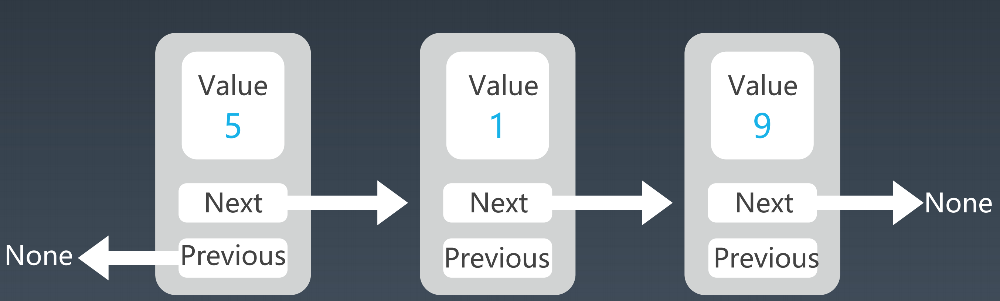

# 学习笔记

[TOC]

## 1.git基本操作

```shell
# 版本号
git --version
# 创建目录
mkdir learn_git
# 查看目录内容
ls -al
# 初始化git目录
git init
# 配置用户信息
git config --global user.name "GeekUniversity"
git config --global user.email "geekuni@geekbang.com"
# 扩展
	git config --local  # 只对当前git仓库有效
	git config --global # 对账户下所有git仓库有效
	git config --system # 对系统里所有账户下的git仓库有效
# 查看git配置信息
git config --global --list
# 清除git配置信息
git config--unset--global 某个配置项
```

## 2.如何高效学习

- 1.5~2倍速看视频，反复暂停看难点
- 五毒神掌（敢于死记硬背

- 要看高票代码与高质量题解（国际版的高票回答

- 做过的题目确保做5遍

## 3.精通一个领域三步走

- 切碎知识点 imgUrl
- 刻意练习
  - 过遍数<**肌肉记忆**>
  - 练习缺陷/弱点
  - 不舒服、不爽、枯燥
  - 生活例子：乒乓球、台球、游戏等等
- 寻求反馈


## 4.训练环境配置

- 电脑设置
  - Chrome默认搜索引擎设为Google
  - Microsoft New Terminal
  - 调快键盘响应速度
- Code Style
  - Google Java Style Guide
- LeetCode.cn
- [刻意练习]编程指法
  - home/end
    	
    - 行头行尾
  - google
    	
    - top tips vs code
      
    - vscode 使用技巧
  - 选中一个单词
    	
    - Ctrl + Shift + ->
- 自顶向下的编程方式
  - 金字塔写作方式

## 5.时间和空间复杂度

1.常见时间复杂度

- O(1): Constant Complexity 常数复杂度
- O(log n): Logarithmic Complexity 对数复杂度

- O(n): Linear Complexity 线性时间复杂度

- O(n^2): N square Complexity 平⽅

- O(n^3): N square Complexity ⽴⽅

- O(2^n): Exponential Growth 指数

- O(n!): Factorial 阶乘

2.为什么斐波那契时间复杂度是指数级


3.思考题

- 二叉树遍历 - 前序、中序、后序：时间复杂度是多少？O(n)
- 图的遍历：时间复杂度是多少？O(n)
- 搜索算法：DFS、BFS 时间复杂度是多少？O(n)
- 二分查找：时间复杂度是多少？O(log n)	

## 6.数组

图示


ArrayList源码

```java
 336:   public boolean add(E e)
 337:   {
 338:     modCount++;
 339:     if (size == data.length)
 340:       ensureCapacity(size + 1);
 341:     data[size++] = e;
 342:     return true;
 343:   }

 354:   public void add(int index, E e)
 355:   {
 356:     checkBoundInclusive(index);
 357:     modCount++;
 358:     if (size == data.length)
 359:       ensureCapacity(size + 1);
 360:     if (index != size)
 361:       System.arraycopy(data, index, data, index + 1, size - index);
 362:     data[index] = e;
 363:     size++;
 364:   }

 170:   public void ensureCapacity(int minCapacity)
 171:   {
 172:     int current = data.length;
 173: 
 174:     if (minCapacity > current)
 175:       {
 176:         E[] newData = (E[]) new Object[Math.max(current * 2, minCapacity)];
 177:         System.arraycopy(data, 0, newData, 0, size);
 178:         data = newData;
 179:       }
 180:   }
```

时间复杂度

-    lookup O(1)
-    insert   O(n)
-    delete  O(n)

Array 实战题目

-    移动零

-    盛最多水的容器

-    爬楼梯

-    三数之和
-    删除排序数组中的重复项
-    旋转数组

## 7.链表

双链表图示



单链表源码

```java
class LinkedList { 
    Node head; 
  
	class Node { 
        int data; 
        Node next; 
        Node(int d) { data = d; } 
    } 
}
```

Java双向链表源码

```java
  76: public class LinkedList<T> extends AbstractSequentialList<T>
  77:   implements List<T>, Deque<T>, Cloneable, Serializable
  78: {
  82:   private static final long serialVersionUID = 876323262645176354L;
  83: 
  87:   transient Entry<T> first;
  88: 
  92:   transient Entry<T> last;
  93: 
  97:   transient int size = 0;
  98: 
 102:   private static final class Entry<T>
 103:   {
 105:     T data;
 106: 
 108:     Entry<T> next;
 109: 
 111:     Entry<T> previous;
 112: 
 117:     Entry(T data)
 118:     {
 119:       this.data = data;
 120:     }
 121:   }
```

时间复杂度

-    lookup O(n)

-    insert O(1)

-    delete O(1)

实际运用

​	LRU缓存算法 https://www.jianshu.com/p/b1ab4a170c3c

实战题目 

​	LeetCode 146. LRU缓存机制 https://leetcode-cn.com/problems/lru-cache/	

## 8.跳表

定义

> 跳表（skip list）对标的是平衡树（AVL Tree）和二分查找， 是一种 插入/删除/搜索 都是 O(log n) 的数据结构。1989 年出现。
>
> 它最大的优势是原理简单、容易实现、方便扩展、效率更高。因此 在一些热门的项目里用来替代平衡树，如 Redis、LevelDB 等。

图示


时间复杂度

​	O(logn)

空间复杂度

​	O(n)

实际运用

- Redis 设计与实现 跳跃表 https://redisbook.readthedocs.io/en/latest/internal-datastruct/skiplist.html
- 为啥 redis 使用跳表(skiplist)而不是使用 red-black？https://www.zhihu.com/question/20202931

## 9.栈

**图示**


**特点**

- 后进先出
- 入栈出栈 O(1)
- 查询 O(n)

**应用**

- 浏览器前进后退
- 括号匹配
- 表达式计算

**Stack接口文档**


后进先出更推荐 Deque

```java
Deque<Integer> stack = new ArrayDeque<Integer>();
```

API


**Stack源码**

```java
public class Stack<E> extends Vector<E> {
    public Stack() {}

    public E push(E item) {
        addElement(item);
        return item;
    }

    public synchronized E pop() {
        E       obj;
        int     len = size();
        obj = peek();
        removeElementAt(len - 1);
        return obj;
    }

    public synchronized E peek() {
        int     len = size();
        if (len == 0) throw new EmptyStackException();
        return elementAt(len - 1);
    }

    public boolean empty() {
        return size() == 0;
    }

    public synchronized int search(Object o) {
        int i = lastIndexOf(o);
        if (i >= 0) {
            return size() - i;
        }
        return -1;
    }
}
```

push方法

```java
public E push(E item) {
   addElement(item);
   return item;
}

public synchronized void addElement(E obj) {
    modCount++;
    add(obj, elementData, elementCount);
}
private void add(E e, Object[] elementData, int s) {
    if (s == elementData.length)
        elementData = grow();
    elementData[s] = e;
    elementCount = s + 1;
}
private Object[] grow() {
    return grow(elementCount + 1);
}
private Object[] grow(int minCapacity) {
    int oldCapacity = elementData.length;
    int newCapacity = ArraysSupport.newLength(oldCapacity,
            minCapacity - oldCapacity, /* minimum growth */
            capacityIncrement > 0 ? capacityIncrement : oldCapacity
                                       /* preferred growth */);
    return elementData = Arrays.copyOf(elementData, newCapacity);
}
```

pop方法

```java
    public synchronized E pop() {
        E       obj;
        int     len = size();
        obj = peek();
        removeElementAt(len - 1);
        return obj;
    }

public synchronized void removeElementAt(int index) {
    if (index >= elementCount) {
        throw new ArrayIndexOutOfBoundsException(index + " >= " +
                                                 elementCount);
    }
    else if (index < 0) {
        throw new ArrayIndexOutOfBoundsException(index);
    }
    int j = elementCount - index - 1;
    if (j > 0) {
        System.arraycopy(elementData, index + 1, elementData, index, j);
    }
    modCount++;
    elementCount--;
    elementData[elementCount] = null; /* to let gc do its work */
}
```

peek方法

```java
    public synchronized E peek() {
        int     len = size();
        if (len == 0) throw new EmptyStackException();
        return elementAt(len - 1);
    }


E elementData(int index) {
    return (E) elementData[index];
}
```

**Vector源码**

```java
public synchronized void addElement(E obj) {
    modCount++;
    add(obj, elementData, elementCount);
}

private void add(E e, Object[] elementData, int s) {
    if (s == elementData.length)
        elementData = grow();
    elementData[s] = e;
    elementCount = s + 1;
}

private Object[] grow() {
    return grow(elementCount + 1);
}

private Object[] grow(int minCapacity) {
    int oldCapacity = elementData.length;
    int newCapacity = ArraysSupport.newLength(oldCapacity,
            minCapacity - oldCapacity, /* minimum growth */
            capacityIncrement > 0 ? capacityIncrement : oldCapacity
                                       /* preferred growth */);
    return elementData = Arrays.copyOf(elementData, newCapacity);
}
```


**Stack示例代码**

```java
Stack<Integer> stack = new Stack<>();
stack.push(1);
stack.push(2);
stack.push(3);
stack.push(4);
System.out.println(stack);
System.out.println(stack.search(4));
stack.pop();
stack.pop();
Integer topElement = stack.peek();
System.out.println(topElement);
System.out.println(" 3的位置 " + stack.search(3));
```

**实战题目**

- 20. 有效的括号
- 155. 最小栈
- 84. 柱状图中最大的矩形
- 239. 滑动窗口最大值

## 10.队列

**图示**


**普通队列**

​	

**Queue接口文档**

| Modifier and Type                                            | Method                                                       | Description                                                  |
| ------------------------------------------------------------ | ------------------------------------------------------------ | ------------------------------------------------------------ |
| boolean                                                      | [empty](https://docs.oracle.com/en/java/javase/12/docs/api/java.base/java/util/Stack.html#empty())() | Tests if this stack is empty.                                |
| [E](https://docs.oracle.com/en/java/javase/12/docs/api/java.base/java/util/Stack.html) | [peek](https://docs.oracle.com/en/java/javase/12/docs/api/java.base/java/util/Stack.html#peek())() | Looks at the object at the top of this stack without removing it from the stack. |
| [E](https://docs.oracle.com/en/java/javase/12/docs/api/java.base/java/util/Stack.html) | [pop](https://docs.oracle.com/en/java/javase/12/docs/api/java.base/java/util/Stack.html#pop())() | Removes the object at the top of this stack and returns that object as the value of this function. |
| [E](https://docs.oracle.com/en/java/javase/12/docs/api/java.base/java/util/Stack.html) | [push](https://docs.oracle.com/en/java/javase/12/docs/api/java.base/java/util/Stack.html#push(E))([E](https://docs.oracle.com/en/java/javase/12/docs/api/java.base/java/util/Stack.html) item) | Pushes an item onto the top of this stack.                   |
| int                                                          | [search](https://docs.oracle.com/en/java/javase/12/docs/api/java.base/java/util/Stack.html#search(java.lang.Object))([Object](https://docs.oracle.com/en/java/javase/12/docs/api/java.base/java/lang/Object.html) o) | Returns the 1-based position where an object is on this stack. |

offer					入队

add					入队。失败会报错

remove			出对头，返回对头

poll					出队头，返回队头，会返回null

element			查看对头

peek					查看对头，会返回null

**Queue示例代码**

```java
Queue<String> queue = new LinkedList<String>();
queue.offer("one");
queue.offer("two");
queue.offer("three");
queue.offer("four");
System.out.println(queue);
String polledElement = queue.poll();
System.out.println(polledElement);
System.out.println(queue);
String peekedElement = queue.peek();
System.out.println(peekedElement);
System.out.println(queue);
while(queue.size() > 0) {
 System.out.println(queue.poll());
}
```

## 11.双端队列 

**图示**


**时间复杂度**


**Deque接口文档**


**示例代码**

```java
Deque<String> deque = new LinkedList<String>();
deque.push("a");
deque.push("b");
deque.push("c");
System.out.println(deque);
String str = deque.peek();
System.out.println(str);
System.out.println(deque);
while (deque.size() > 0) {
 System.out.println(deque.pop());
}
System.out.println(deque);
```

# 作业

## **绘制自己的数据结构和算法脑图**


## 简单

### 用 add first 或 add last 这套新的 API 改写 Deque 的代码 

```java
		Deque<String> deque = new LinkedList<String>();
        deque.addFirst("a");    // 从头加
        deque.addLast("b");     // 从尾加
        deque.push("c");        // 从头加
        deque.addFirst("d");    // 从头加
        deque.addLast("e");     // 从尾加
        deque.push("f");        // 从尾加
```


### 分析 Queue 和 Priority Queue 的源码 


```java
/*
	Queue源码分析
	Queue接口定义了6个方法
*/
public interface Queue<E> extends Collection<E> {
    // 添加元素，成功返回true，失败报异常
    boolean add(E e);
    // 添加元素，成功返回true，失败返回false
    boolean offer(E e);
    // 取出并删除对头，如果队列空，则报异常
    E remove();
    // 取出并删除对头，如果队列空，则返回null
    E poll();
    // 取出不删除对头，如果队列空，则报异常
    E element();
    // 取出不删除对头，如果队列空，则返回null
    E peek();
}
```


```java
package com.example.demo;

import java.util.*;
import java.util.function.Consumer;

public class PriorityQueue<E> extends AbstractQueue<E> implements java.io.Serializable {

    // 默认大小
    private static final int DEFAULT_INITIAL_CAPACITY = 11;
    // 队列。底层是平衡二叉树。按照自定义序或者自然序。不允许空。
    // 只保证了头元素是最小的。并不保证有序。
    transient Object[] queue; // transient关键字标识不会被序列化
    // 队列元素个数
    private int size = 0;
    // 自定义比较器。空就使用自然序。
    private final Comparator<? super E> comparator;
    // 队列被结构性修改的次数。
    transient int modCount = 0;
    // 创建初始值为11的自然序队列
    public PriorityQueue() {
        this(DEFAULT_INITIAL_CAPACITY, null);
    }
    // 指定初始值大小
    public PriorityQueue(int initialCapacity) {
        this(initialCapacity, null);
    }
    public PriorityQueue(Comparator<? super E> comparator) {
        this(DEFAULT_INITIAL_CAPACITY, comparator);
    }
    public PriorityQueue(int initialCapacity,
                         Comparator<? super E> comparator) {
        if (initialCapacity < 1)
            throw new IllegalArgumentException();
        this.queue = new Object[initialCapacity];
        this.comparator = comparator;
    }
    public PriorityQueue(Collection<? extends E> c) {
        // 是SortedSet实例，就用SortedSet的比较器
        if (c instanceof SortedSet<?>) {
            SortedSet<? extends E> ss = (SortedSet<? extends E>) c;
            this.comparator = (Comparator<? super E>) ss.comparator();
            initElementsFromCollection(ss);
        }
        // 是PriorityQueue实例，就用PriorityQueue的比较器
        else if (c instanceof PriorityQueue<?>) {
            PriorityQueue<? extends E> pq = (PriorityQueue<? extends E>) c;
            this.comparator = (Comparator<? super E>) pq.comparator();
            initFromPriorityQueue(pq);
        }
        else {
            // 其余情况，没有自定义比较器
            this.comparator = null;
            initFromCollection(c);
        }
    }
    public PriorityQueue(PriorityQueue<? extends E> c) {
        this.comparator = (Comparator<? super E>) c.comparator();
        initFromPriorityQueue(c);
    }
    public PriorityQueue(SortedSet<? extends E> c) {
        this.comparator = (Comparator<? super E>) c.comparator();
        initElementsFromCollection(c);
    }
    private void initFromPriorityQueue(PriorityQueue<? extends E> c) {
        if (c.getClass() == PriorityQueue.class) {
            // 队列转成数组
            this.queue = c.toArray();
            this.size = c.size();
        } else {
            initFromCollection(c);
        }
    }
	// 根据集合初始化元素
    private void initElementsFromCollection(Collection<? extends E> c) {
        Object[] a = c.toArray();
        // If c.toArray incorrectly doesn't return Object[], copy it.
        if (a.getClass() != Object[].class)
            a = Arrays.copyOf(a, a.length, Object[].class);
        int len = a.length;
        if (len == 1 || this.comparator != null)
            for (int i = 0; i < len; i++)
                if (a[i] == null)
                    throw new NullPointerException();
        this.queue = a;
        this.size = a.length;
    }
    // 根据给定集合初始值队列数组
    private void initFromCollection(Collection<? extends E> c) {
        initElementsFromCollection(c);
        heapify();
    }
    // 虚拟机能开辟的最大数组
    private static final int MAX_ARRAY_SIZE = Integer.MAX_VALUE - 8;
    // 数组扩容
    private void grow(int minCapacity) {
        int oldCapacity = queue.length;
        // 不足64。扩容两倍+2。超过64，扩容1.5倍。
        int newCapacity = oldCapacity + ((oldCapacity < 64) ?
                                         (oldCapacity + 2) :
                                         (oldCapacity >> 1));
        // overflow-conscious code
        if (newCapacity - MAX_ARRAY_SIZE > 0)
            newCapacity = hugeCapacity(minCapacity);
        queue = Arrays.copyOf(queue, newCapacity);
    }

    private static int hugeCapacity(int minCapacity) {
        if (minCapacity < 0) // 溢出，报OOM错误
            throw new OutOfMemoryError();
        return (minCapacity > MAX_ARRAY_SIZE) ?
            Integer.MAX_VALUE :
            MAX_ARRAY_SIZE;
    }
    // add底层调的offer
    public boolean add(E e) {
        return offer(e);
    }

    public boolean offer(E e) {
        // 添加元素为空，抛异常
        if (e == null)
            throw new NullPointerException();
        // 修改数+1
        modCount++;
        int i = size;
        // 个数超过数组大小，扩容
        if (i >= queue.length)
            grow(i + 1);
        size = i + 1;
        if (i == 0) // 空数组直接加
            queue[0] = e;
        else
            siftUp(i, e); // i数组大小，e添加元素
        return true;
    }

    public E peek() {
        return (size == 0) ? null : (E) queue[0];
    }

    private int indexOf(Object o) {
        if (o != null) {
            for (int i = 0; i < size; i++)
                if (o.equals(queue[i]))
                    return i;
        }
        return -1;
    }

    public boolean remove(Object o) {
        int i = indexOf(o);
        if (i == -1)
            return false;
        else {
            removeAt(i);
            return true;
        }
    }

    boolean removeEq(Object o) {
        for (int i = 0; i < size; i++) {
            if (o == queue[i]) {
                removeAt(i);
                return true;
            }
        }
        return false;
    }

    public boolean contains(Object o) {
        return indexOf(o) != -1;
    }

    public Object[] toArray() {
        return Arrays.copyOf(queue, size);
    }

    public <T> T[] toArray(T[] a) {
        final int size = this.size;
        if (a.length < size)
            // Make a new array of a's runtime type, but my contents:
            return (T[]) Arrays.copyOf(queue, size, a.getClass());
        System.arraycopy(queue, 0, a, 0, size);
        if (a.length > size)
            a[size] = null;
        return a;
    }

    public Iterator<E> iterator() {
        return new Itr();
    }

    private final class Itr implements Iterator<E> {

        private int cursor = 0;

        private int lastRet = -1;

        private ArrayDeque<E> forgetMeNot = null;

        private E lastRetElt = null;

        private int expectedModCount = modCount;

        public boolean hasNext() {
            return cursor < size ||
                (forgetMeNot != null && !forgetMeNot.isEmpty());
        }

        public E next() {
            if (expectedModCount != modCount)
                throw new ConcurrentModificationException();
            if (cursor < size)
                return (E) queue[lastRet = cursor++];
            if (forgetMeNot != null) {
                lastRet = -1;
                lastRetElt = forgetMeNot.poll();
                if (lastRetElt != null)
                    return lastRetElt;
            }
            throw new NoSuchElementException();
        }

        public void remove() {
            if (expectedModCount != modCount)
                throw new ConcurrentModificationException();
            if (lastRet != -1) {
                E moved = PriorityQueue.this.removeAt(lastRet);
                lastRet = -1;
                if (moved == null)
                    cursor--;
                else {
                    if (forgetMeNot == null)
                        forgetMeNot = new ArrayDeque<>();
                    forgetMeNot.add(moved);
                }
            } else if (lastRetElt != null) {
                PriorityQueue.this.removeEq(lastRetElt);
                lastRetElt = null;
            } else {
                throw new IllegalStateException();
            }
            expectedModCount = modCount;
        }
    }

    public int size() {
        return size;
    }

    public void clear() {
        modCount++;
        for (int i = 0; i < size; i++)
            queue[i] = null;
        size = 0;
    }

    public E poll() {
        if (size == 0)
            return null;
        int s = --size;
        modCount++;
        E result = (E) queue[0];
        E x = (E) queue[s];
        queue[s] = null;
        if (s != 0)
            siftDown(0, x);
        return result;
    }

    private E removeAt(int i) {
        // assert i >= 0 && i < size;
        modCount++;
        int s = --size;
        if (s == i) // removed last element
            queue[i] = null;
        else {
            E moved = (E) queue[s];
            queue[s] = null;
            // 与下层元素交换
            siftDown(i, moved);
            if (queue[i] == moved) {
                siftUp(i, moved);
                if (queue[i] != moved)
                    return moved;
            }
        }
        return null;
    }
    // 与上层元素交换
    private void siftUp(int k, E x) {
        if (comparator != null) // 用自定义比较器
            siftUpUsingComparator(k, x);
        else
            siftUpComparable(k, x); // 用自然序比较器
    }

    private void siftUpComparable(int k, E x) { // k数组大小，x添加元素
        Comparable<? super E> key = (Comparable<? super E>) x;
        while (k > 0) {
            int parent = (k - 1) >>> 1;
            Object e = queue[parent];
            if (key.compareTo((E) e) >= 0)
                break;
            queue[k] = e;
            k = parent;
        }
        queue[k] = key;
    }

    private void siftUpUsingComparator(int k, E x) {
        while (k > 0) {
            int parent = (k - 1) >>> 1;
            Object e = queue[parent];
            if (comparator.compare(x, (E) e) >= 0)
                break;
            queue[k] = e;
            k = parent;
        }
        queue[k] = x;
    }

    private void siftDown(int k, E x) {
        if (comparator != null)
            siftDownUsingComparator(k, x);
        else
            siftDownComparable(k, x);
    }

    private void siftDownComparable(int k, E x) {
        Comparable<? super E> key = (Comparable<? super E>)x;
        int half = size >>> 1;        // loop while a non-leaf
        while (k < half) {
            int child = (k << 1) + 1; // assume left child is least
            Object c = queue[child];
            int right = child + 1;
            if (right < size &&
                ((Comparable<? super E>) c).compareTo((E) queue[right]) > 0)
                c = queue[child = right];
            if (key.compareTo((E) c) <= 0)
                break;
            queue[k] = c;
            k = child;
        }
        queue[k] = key;
    }

    private void siftDownUsingComparator(int k, E x) {
        int half = size >>> 1;
        while (k < half) {
            int child = (k << 1) + 1;
            Object c = queue[child];
            int right = child + 1;
            if (right < size &&
                comparator.compare((E) c, (E) queue[right]) > 0)
                c = queue[child = right];
            if (comparator.compare(x, (E) c) <= 0)
                break;
            queue[k] = c;
            k = child;
        }
        queue[k] = x;
    }
	// 堆化
    private void heapify() {
        for (int i = (size >>> 1) - 1; i >= 0; i--)
            siftDown(i, (E) queue[i]);
    }

    public Comparator<? super E> comparator() {
        return comparator;
    }

    private void writeObject(java.io.ObjectOutputStream s)
        throws java.io.IOException {
        // Write out element count, and any hidden stuff
        s.defaultWriteObject();

        // Write out array length, for compatibility with 1.5 version
        s.writeInt(Math.max(2, size + 1));

        // Write out all elements in the "proper order".
        for (int i = 0; i < size; i++)
            s.writeObject(queue[i]);
    }

    private void readObject(java.io.ObjectInputStream s)
        throws java.io.IOException, ClassNotFoundException {
        // Read in size, and any hidden stuff
        s.defaultReadObject();

        // Read in (and discard) array length
        s.readInt();

        queue = new Object[size];

        // Read in all elements.
        for (int i = 0; i < size; i++)
            queue[i] = s.readObject();

        // Elements are guaranteed to be in "proper order", but the
        // spec has never explained what that might be.
        heapify();
    }

    public final Spliterator<E> spliterator() {
        return new PriorityQueueSpliterator<E>(this, 0, -1, 0);
    }

    static final class PriorityQueueSpliterator<E> implements Spliterator<E> {
        /*
         * This is very similar to ArrayList Spliterator, except for
         * extra null checks.
         */
        private final PriorityQueue<E> pq;
        private int index;            // current index, modified on advance/split
        private int fence;            // -1 until first use
        private int expectedModCount; // initialized when fence set

        /** Creates new spliterator covering the given range */
        PriorityQueueSpliterator(PriorityQueue<E> pq, int origin, int fence,
                             int expectedModCount) {
            this.pq = pq;
            this.index = origin;
            this.fence = fence;
            this.expectedModCount = expectedModCount;
        }

        private int getFence() { // initialize fence to size on first use
            int hi;
            if ((hi = fence) < 0) {
                expectedModCount = pq.modCount;
                hi = fence = pq.size;
            }
            return hi;
        }

        public PriorityQueueSpliterator<E> trySplit() {
            int hi = getFence(), lo = index, mid = (lo + hi) >>> 1;
            return (lo >= mid) ? null :
                new PriorityQueueSpliterator<E>(pq, lo, index = mid,
                                                expectedModCount);
        }

        public void forEachRemaining(Consumer<? super E> action) {
            int i, hi, mc; // hoist accesses and checks from loop
            PriorityQueue<E> q; Object[] a;
            if (action == null)
                throw new NullPointerException();
            if ((q = pq) != null && (a = q.queue) != null) {
                if ((hi = fence) < 0) {
                    mc = q.modCount;
                    hi = q.size;
                }
                else
                    mc = expectedModCount;
                if ((i = index) >= 0 && (index = hi) <= a.length) {
                    for (E e;; ++i) {
                        if (i < hi) {
                            if ((e = (E) a[i]) == null) // must be CME
                                break;
                            action.accept(e);
                        }
                        else if (q.modCount != mc)
                            break;
                        else
                            return;
                    }
                }
            }
            throw new ConcurrentModificationException();
        }

        public boolean tryAdvance(Consumer<? super E> action) {
            if (action == null)
                throw new NullPointerException();
            int hi = getFence(), lo = index;
            if (lo >= 0 && lo < hi) {
                index = lo + 1;
                @SuppressWarnings("unchecked") E e = (E)pq.queue[lo];
                if (e == null)
                    throw new ConcurrentModificationException();
                action.accept(e);
                if (pq.modCount != expectedModCount)
                    throw new ConcurrentModificationException();
                return true;
            }
            return false;
        }

        public long estimateSize() {
            return (long) (getFence() - index);
        }

        public int characteristics() {
            return Spliterator.SIZED | Spliterator.SUBSIZED | Spliterator.NONNULL;
        }
    }
}
```

### [删除排序数组中的重复项](https://leetcode-cn.com/problems/remove-duplicates-from-sorted-array/)

（Facebook、字节跳动、微软在半年内面试中考过）

```java
/*
    题目：在不创建新数组的条件下，在原数组中删除重复出现的数字。
    PS:数组是引用传递的，传递的是数组的头节点。对数组的修改会对调用者产生影响。
    !只修改前几个数就可以了
    方法一：快慢指针。题目中的数组是排序过了的，不需要单独排序。如果没排序过就Arrays.sort()
        left慢指针，right快指针。
        left左边是处理过的，right右边是未处理过的。
        由right遍历一遍数组。left记录下一个没有重复的数放置的位置。
    时间复杂度：O(n)
    空间复杂度：O(1)    
*/
class Solution {
    public int removeDuplicates(int[] nums) {
        if (nums.length == 0) return 0;
        // 快慢指针。left慢指针。right快指针。
        // 0到left是非重复元素。right到length-1是待检测元素
        int left = 0;
        for (int right = 1; right < nums.length; right++) {
            // 指针不相等时，将右指针的值放入左指针+1的位置
            if (nums[left] != nums[right]) {
                nums[++left] = nums[right];
            }    
        }           
        return left + 1;
    }
}
```

### [旋转数组](https://leetcode-cn.com/problems/rotate-array/)

（微软、亚马逊、PayPal 在半年内面试中考过）

```java
/*
    题目：将数组中的整体元素向右移动k个位置。
    方法一：暴力。
        i -> 0, k-1
            j -> 0, length -1        
                移动k次。没个数字都移动一遍。交换位置。
        时间复杂度O(n*k)
        空间复杂度O(1) 不需要额外空间
    方法二：建立新数组。
        先将原数组的数据拷贝到新数组中。
        再将新数组中的数据拷贝到原数组中。
        时间复杂度O(n*2)
        空间复杂度O(n) 
    方法三：将数字做反转。有点像是公式。！这个解法最精妙。
        先将整个数组反转。
        然后将0,k-1的数字反转
        再将k,len - 1的数字反转。
        就是所要的结果。
        时间复杂度O(n*2)
        空间复杂度O(1)
    方法四：直接将数字放到最后的结果位置，相应间隔的都换位置。然后下一个，同样相应间隔的都换位置。数量达到数组个数退出。
        时间复杂度：O(n)
        空间复杂度：O(1)
*/
/*
public class Solution {
    public void rotate(int[] nums, int k) {
        k = k % nums.length;    // 对k取模，重复的圈数不需要计算
        int count = 0;          // 计数位，达到数组个数就完成了
        for (int start = 0; count < nums.length; start++) {
            int current = start;        // 当前位置
            int prev = nums[start];     // 出发值
            do {
                int next = (current + k) % nums.length; // 目标位置  
                // 交换                                                      
                int temp = nums[next];                  // 目标位置的值
                nums[next] = prev;                      // 目标位置的值改为出发值
                prev = temp;                            // 出发值改为目标位置的值
                current = next;                         // 当前索引改为目标位置的索引
                count++;                                // 计数+1
            } while (start != current);                 // 相对应的间隔位的数字都会移动到目标位置
        }
    }
}
*/
public class Solution {
    public void rotate(int[] nums, int k) {
        k %= nums.length;
        reverse(nums, 0, nums.length - 1);
        reverse(nums, 0, k - 1);
        reverse(nums, k, nums.length - 1);
    }
    public void reverse(int[] nums, int start, int end) {
        while (start < end) {
            int temp = nums[start];
            nums[start] = nums[end];
            nums[end] = temp;
            start++;
            end--;
        }
    }
}
```


### [合并两个有序链表](https://leetcode-cn.com/problems/merge-two-sorted-lists/)

（亚马逊、字节跳动在半年内面试常考）

```java
/**
 * Definition for singly-linked list.
 * public class ListNode {
 *     int val;
 *     ListNode next;
 *     ListNode(int x) { val = x; }
 * }
        题目：合并两个升序链表（已经升序处理过了），数字从小到大
        解法一：递归
            子问题与原问题有相同的结构
            时间复杂度: O(n+m)
            空间复杂度: O(n+m)
        解法二：暴力迭代：比较大小，然后改指向
            时间复杂度：O(n+m)
            空间复杂度：O(1)
 */
class Solution {
    public ListNode mergeTwoLists(ListNode l1, ListNode l2) {
        if (l1 == null) return l2;                  // 链表1空，返回链表2
        else if (l2 == null) return l1;             // 链表2空，返回链表1
        else if (l1.val < l2.val) {                 // 链表1的值小
            l1.next = mergeTwoLists(l1.next, l2);   // 链表1指向 （链表1的下一个值与链表2合并）的结果
            return l1;                              // 返回链表1
        }
        else {                                      // 链表2的值小
            l2.next = mergeTwoLists(l1, l2.next);   // 链表2指向 （链表1与链表2的下一个值合并）的结果
            return l2;                              // 返回链表2                  
        }
    }
}
```


### [合并两个有序数组](https://leetcode-cn.com/problems/merge-sorted-array/)

（Facebook 在半年内面试常考）

```java
/*
    题目：将数组2放入数组1中，并且排序。
        感觉这题靠API的使用。
        解法一：先合并，后排序
            System.arraycopy(nums2, 0, nums1, m, n);
            Arrays.sort(nums1);
            时间复杂度 : O( (n+m) * log(n+m) )
            空间复杂度 : O(1)
        解法二：双指针
            时间复杂度 : O(n + m)
            空间复杂度 : O(m)
            拷贝数字1为新数组。
                两个指针，比较数组1和数组2的大小，小的放入新数组中。
                比较完，剩余的放在新数组后面。
        解法三：三指针，从后往前放。
            p指针指向要放置的位置。p1指向数组1比较的值。p2指向数组2比较的值。
            时间复杂度 : O(n + m)
            空间复杂度 : O(1)
*/
class Solution {
  public void merge(int[] nums1, int m, int[] nums2, int n) {
    // two get pointers for nums1 and nums2
    int p1 = m - 1;
    int p2 = n - 1;
    // set pointer for nums1
    int p = m + n - 1;
    // while there are still elements to compare
    while ((p1 >= 0) && (p2 >= 0))
      // compare two elements from nums1 and nums2 
      // and add the largest one in nums1 
      nums1[p--] = (nums1[p1] < nums2[p2]) ? nums2[p2--] : nums1[p1--];
    // add missing elements from nums2
    System.arraycopy(nums2, 0, nums1, 0, p2 + 1);
  }
}

```


### [两数之和](https://leetcode-cn.com/problems/two-sum/)

（亚马逊、字节跳动、谷歌、Facebook、苹果、微软在半年内面试中高频常考）

```java
/*
    找出数组中两个数字满足目标值的两个数字
        方法一：暴力迭代
            i -> 0, len - 2
                j -> i+1, len - 1
                    nums[i] + nums[j] == target
        时间复杂度O(n^2)
        空间复杂度O(n)
        方法二： 利用哈希表，两次迭代
            第一次，将所有数字放入哈希表中，
            第二次，遍历哈希表，查找目标值-当前值的结果是否在哈希中
        时间复杂度O(n * 2)
        空间复杂度O(n)    
        方法三：利用哈希表，两次迭代
            其实只需要一次，先判断目标值-当前值的结果是否在哈希中，
                不存在，在把值放进去。
        时间复杂度：O(n)
        空间复杂度：O(n)

*/
class Solution {
    public int[] twoSum(int[] nums, int target) {
        Map<Integer, Integer> map = new HashMap<>();
        for (int i = 0; i < nums.length; i++) {
            int complement = target - nums[i];
            if (map.containsKey(complement)) {
                return new int[] { map.get(complement), i };
            }
            map.put(nums[i], i);
        }
        throw new IllegalArgumentException("No two sum solution");
    }
}
```


### [移动零](https://leetcode-cn.com/problems/move-zeroes/)

（Facebook、亚马逊、苹果在半年内面试中考过）

```java
/*
    将数组中的0移动到最后，保持原来的非零数字的顺序。
        要求不能开辟新数组。
        方法一：
            开辟新数组。遍历一次，一边统计0的个数，一将非0放入新数组中。第二次将0追加到新数组中。不满足题目要求。
            time:  O(n * 2)
            space: O(n)
        方法二：
            开辟新数组。双指针。一个指针指向头，非0数字放入，一个指针指向尾，0放入。不满足题目要求。
            time:  O(n)
            space: O(n)
        方法三：
            一个指针。记录非0元素放置的位置target。遍历一次，非0就放入target的位置。
            time:  O(n)
            space: O(1)
*/
public class Solution {
    public void moveZeroes(int[] nums) {
        int target = 0;
        for(int i = 0; i < nums.length; i++) 
            // 遍历到的数字非0，放到目标位置。
            if(nums[i] != 0) {
                int tmp = nums[target];
                nums[target] = nums[i];
                nums[i] = tmp;
                target++;
            }
    }
}
```


### [加一](https://leetcode-cn.com/problems/plus-one/)

（谷歌、字节跳动、Facebook 在半年内面试中考过）

```java
/*
    一个数字组成的数组。转成数字，然后+1。再转成数组
        方法一：从后往前遍历。
            目标值不是9，直接+1，结束。
            目标值是9，当前位置值变为0，下个数+1。
            最后还是没结束，说明碰到了9999，需要开辟新数组，头为1。
            time:  O(n)
            space: O(n+1)
*/
class Solution {
    public int[] plusOne(int[] digits) {
        int len = digits.length;
        // 从后往前遍历
        for (int i = len-1; i >= 0; i--) {
            // 数字不是9，直接自增，返回结果。
            if (digits[i] != 9) {
                digits[i]++;
                return digits;
            }
            // 是9，当前值变为0。继续遍历，把下个值+1。
            digits[i] = 0;
        }
        // 没结束，说明碰到了9999这种情况，开辟新数组，数组头写成1。
        int[] newNumber = new int [len+1];
        newNumber[0] = 1;
        return newNumber;
    }
}
```


## 中等

### [设计循环双端队列](https://leetcode.com/problems/design-circular-deque)

（Facebook 在 1 年内面试中考过）

```java
class MyCircularDeque {
    int size;
    int k;
    DoubleListNode head;
    DoubleListNode tail;
    /** Initialize your data structure here. Set the size of the deque to be k. */
    public MyCircularDeque(int k) {
        head = new DoubleListNode(-1);
        tail = new DoubleListNode(-1);
        head.pre = tail;
        tail.next = head;
        this.k = k;
        this.size = 0;
    }
    
    /** Adds an item at the front of Deque. Return true if the operation is successful. */
    public boolean insertFront(int value) {
        if (size == k)
            return false;
        DoubleListNode node = new DoubleListNode(value);
        node.next = head;
        node.pre = head.pre;
        head.pre.next = node;
        head.pre = node;
        size++;
        return true;
    }
    
    /** Adds an item at the rear of Deque. Return true if the operation is successful. */
    public boolean insertLast(int value) {
        if (size == k)
            return false;
        DoubleListNode node = new DoubleListNode(value);
        node.next = tail.next;
        tail.next.pre = node;
        tail.next = node;
        node.pre = tail;
        size++;
        return true;
    }
    
    /** Deletes an item from the front of Deque. Return true if the operation is successful. */
    public boolean deleteFront() {
        if (size == 0)
            return false;
        head.pre.pre.next = head;
        head.pre = head.pre.pre;
        size--;
        return true;
    }
    
    /** Deletes an item from the rear of Deque. Return true if the operation is successful. */
    public boolean deleteLast() {
        if (size == 0)
            return false;
        tail.next.next.pre = tail;
        tail.next = tail.next.next;
        size--;
        return true;
    }
    
    /** Get the front item from the deque. */
    public int getFront() {
        return head.pre.val;
    }
    
    /** Get the last item from the deque. */
    public int getRear() {
        return tail.next.val;
    }
    
    /** Checks whether the circular deque is empty or not. */
    public boolean isEmpty() {
        return size == 0;
    }
    
    /** Checks whether the circular deque is full or not. */
    public boolean isFull() {
        return size == k;
    }
}

class DoubleListNode {
    DoubleListNode pre;
    DoubleListNode next;
    int val;
    public DoubleListNode(int val) {
        this.val = val;
    }
}
```


## 困难

### [接雨水](https://leetcode.com/problems/trapping-rain-water/)

（亚马逊、字节跳动、高盛集团、Facebook 在半年内面试常考）

```java
public int trap(int[] A){
    int a=0;
    int b=A.length-1;
    int max=0;
    int leftmax=0;
    int rightmax=0;
    while(a<=b){
        leftmax=Math.max(leftmax,A[a]);
        rightmax=Math.max(rightmax,A[b]);
        if(leftmax<rightmax){
            max+=(leftmax-A[a]);       // leftmax is smaller than rightmax, so the (leftmax-A[a]) water can be stored
            a++;
        }
        else{
            max+=(rightmax-A[b]);
            b--;
        }
    }
    return max;
}
```

