[TOC]

笔记HTML版本http://htmlpreview.github.io/?https://github.com/woshiamiaojiang/algorithm012/blob/master/Week_02/README.html

## 学习笔记

### 1.哈希表

#### 定义

`通过哈希函数将key映射到表中位置来访问记录`

#### 图示

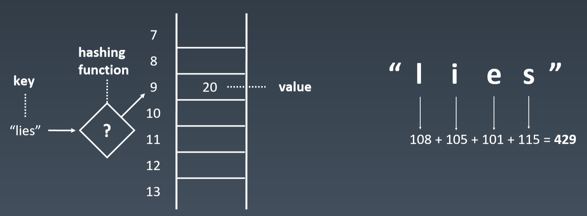


#### 具体实现是Map和Set

**API**


**set**

TreeSet, HashSet,

ConcurrentSkipListSet, CopyOnWriteArraySet, EnumSet, JobStateReasons, LinkedHashSet

**map**

HashMap, Hashtable, ConcurrentHashMap

#### HashSet源码分析

```java
package java.util;

import java.io.InvalidObjectException;

/**
 * 实现set接口, 底层HashMap。不保证每次的遍历顺序（无序的）。允许null值。
 *
 * 基本操作的时间复杂度是一样的
 * (add, remove, contains, size)
 * 通过Hash函数将元素均匀散射在数组桶里。
 * 遍历速度与元素数量+数组桶的和成正比。
 * 因此初始值不要设的太大。
 *
 * 线程不安全，创建时使用Collections.synchronizedSet
 *
 *   Set s = Collections.synchronizedSet(new HashSet(...));</pre>
 *
 * 迭代器返回是快速-失败的:
 *
 * 迭代器创建时，使用非迭代器自己的remove方法，迭代器会抛并发修改异常。
 * 面对并发修改，迭代器会快速-失败，以免日后发生意外。
 *
 * 出现非同步并发修改，并不能保证都引发迭代器的快速-失败机制。
 * 所以不能通过并发修改异常判断正确性。
 * 迭代器的快速-失败机制只是用来检测bug的。
 *
 * 这个类是Java集合框架的一员
 *
 * @param <E> 哈希集合维护的元素类型
 * @see     Collection
 * @see     Set
 * @see     TreeSet
 * @see     HashMap
 */

public class HashSet<E>
        extends AbstractSet<E>
        implements Set<E>, Cloneable, java.io.Serializable
{
    static final long serialVersionUID = -5024744406713321676L;

    private transient HashMap<E,Object> map;

    // 底层HashMap，放了个哑值（虚拟值/伪值）
    private static final Object PRESENT = new Object();

    /**
     * 创建空set。底层是HashMap实例。初始值是16，负载因子0.75。
     */
    public HashSet() {
        map = new HashMap<>();
    }

    /**
     * 创建包含指定集合的set。HashMap默认0.75负载因子，容量足够含盖集合元素。
     * 会抛空指针异常 c不能为null
     */
    public HashSet(Collection<? extends E> c) {
        map = new HashMap<>(Math.max((int) (c.size()/.75f) + 1, 16));
        addAll(c);
    }

    /**
     * 创建空set。指定初始容量与负载因子。
     * 初始值要大于等于0，负载因子不能是负数
     */
    public HashSet(int initialCapacity, float loadFactor) {
        map = new HashMap<>(initialCapacity, loadFactor);
    }

    public HashSet(int initialCapacity) {
        map = new HashMap<>(initialCapacity);
    }

    HashSet(int initialCapacity, float loadFactor, boolean dummy) {
        map = new LinkedHashMap<>(initialCapacity, loadFactor);
    }

    /**
     * 返回迭代器。元素遍历无序。
     */
    public Iterator<E> iterator() {
        return map.keySet().iterator();
    }

    public int size() {
        return map.size();
    }

    public boolean isEmpty() {
        return map.isEmpty();
    }

    /**
     * 底层是map.containsKey
     */
    public boolean contains(Object o) {
        return map.containsKey(o);
    }

    /**
     * 底层是map.put(e, 哑值)
     */
    public boolean add(E e) {
        return map.put(e, PRESENT)==null;
    }

    public boolean remove(Object o) {
        return map.remove(o)==PRESENT;
    }

    public void clear() {
        map.clear();
    }

    /**
     * 浅拷贝
     */
    @SuppressWarnings("unchecked")
    public Object clone() {
        try {
            HashSet<E> newSet = (HashSet<E>) super.clone();
            newSet.map = (HashMap<E, Object>) map.clone();
            return newSet;
        } catch (CloneNotSupportedException e) {
            throw new InternalError(e);
        }
    }

    /**
     * @serialData The capacity of the backing <tt>HashMap</tt> instance
     *             (int), and its load factor (float) are emitted, followed by
     *             the size of the set (the number of elements it contains)
     *             (int), followed by all of its elements (each an Object) in
     *             no particular order.
     * 把HashSet实例状态写到流中（序列化）。
     */
    private void writeObject(java.io.ObjectOutputStream s)
            throws java.io.IOException {
        // Write out any hidden serialization magic
        s.defaultWriteObject();

        // Write out HashMap capacity and load factor
        s.writeInt(map.capacity());
        s.writeFloat(map.loadFactor());

        // Write out size
        s.writeInt(map.size());

        // Write out all elements in the proper order.
        for (E e : map.keySet())
            s.writeObject(e);
    }

    /**
     * 反序列化
     */
    private void readObject(java.io.ObjectInputStream s)
            throws java.io.IOException, ClassNotFoundException {
        // Read in any hidden serialization magic
        s.defaultReadObject();

        // Read capacity and verify non-negative.
        int capacity = s.readInt();
        if (capacity < 0) {
            throw new InvalidObjectException("Illegal capacity: " +
                    capacity);
        }

        // Read load factor and verify positive and non NaN.
        float loadFactor = s.readFloat();
        if (loadFactor <= 0 || Float.isNaN(loadFactor)) {
            throw new InvalidObjectException("Illegal load factor: " +
                    loadFactor);
        }

        // Read size and verify non-negative.
        int size = s.readInt();
        if (size < 0) {
            throw new InvalidObjectException("Illegal size: " +
                    size);
        }

        // Set the capacity according to the size and load factor ensuring that
        // the HashMap is at least 25% full but clamping to maximum capacity.
        capacity = (int) Math.min(size * Math.min(1 / loadFactor, 4.0f),
                HashMap.MAXIMUM_CAPACITY);

        // Create backing HashMap
        map = (((HashSet<?>)this) instanceof LinkedHashSet ?
                new LinkedHashMap<E,Object>(capacity, loadFactor) :
                new HashMap<E,Object>(capacity, loadFactor));

        // Read in all elements in the proper order.
        for (int i=0; i<size; i++) {
            @SuppressWarnings("unchecked")
            E e = (E) s.readObject();
            map.put(e, PRESENT);
        }
    }

    /**
     * Creates a <em><a href="Spliterator.html#binding">late-binding</a></em>
     * and <em>fail-fast</em> {@link Spliterator} over the elements in this
     * set.
     *
     * <p>The {@code Spliterator} reports {@link Spliterator#SIZED} and
     * {@link Spliterator#DISTINCT}.  Overriding implementations should document
     * the reporting of additional characteristic values.
     *
     * @return a {@code Spliterator} over the elements in this set
     * @since 1.8
     */
    public Spliterator<E> spliterator() {
        return new HashMap.KeySpliterator<E,Object>(map, 0, -1, 0, 0);
    }
}
```

#### <a name=HashMap>HashMap源码分析</a>

```java
/**
 * HashMap是常用的Java集合之一，是基于哈希表的Map接口的实现。与HashTable主要区别为不支持同步和允许null作为key和value。
 * HashMap非线程安全，即任一时刻可以有多个线程同时写HashMap，可能会导致数据的不一致。
 * 如果需要满足线程安全，可以用 Collections的synchronizedMap方法使HashMap具有线程安全的能力，或者使用ConcurrentHashMap。
 * 在JDK1.6中，HashMap采用数组+链表实现，即使用链表处理冲突，同一hash值的链表都存储在一个链表里。
 * 但是当位于一个数组中的元素较多，即hash值相等的元素较多时，通过key值依次查找的效率较低。
 * 而JDK1.8中，HashMap采用数组+链表+红黑树实现，当链表长度超过阈值8时，将链表转换为红黑树，这样大大减少了查找时间。
 * 原本Map.Entry接口的实现类Entry改名为了Node。转化为红黑树时改用另一种实现TreeNode。
 */
public class HashMap<K, V> extends AbstractMap<K, V>
        implements Map<K, V>, Cloneable, Serializable {

    private static final long serialVersionUID = 362498820763181265L;


    /**
     * 默认的初始容量（容量为HashMap中槽的数目）是16，且实际容量必须是2的整数次幂。
     */
    static final int DEFAULT_INITIAL_CAPACITY = 1 << 4; // aka 16

    /**
     * 最大容量（必须是2的幂且小于2的30次方，传入容量过大将被这个值替换）
     */
    static final int MAXIMUM_CAPACITY = 1 << 30;

    /**
     * 默认装填因子0.75，如果当前键值对个数 >= HashMap最大容量*装填因子，进行rehash操作
     */
    static final float DEFAULT_LOAD_FACTOR = 0.75f;

    /**
     * JDK1.8 新加，Entry链表最大长度，当桶中节点数目大于该长度时，将链表转成红黑树存储；
     */
    static final int TREEIFY_THRESHOLD = 8;

    /**
     * JDK1.8 新加，当桶中节点数小于该长度，将红黑树转为链表存储；
     */
    static final int UNTREEIFY_THRESHOLD = 6;

    /**
     * 桶可能被转化为树形结构的最小容量。当哈希表的大小超过这个阈值，才会把链式结构转化成树型结构，否则仅采取扩容来尝试减少冲突。
     * 应该至少4*TREEIFY_THRESHOLD来避免扩容和树形结构化之间的冲突。
     */
    static final int MIN_TREEIFY_CAPACITY = 64;

    /**
     * JDK1.6用Entry描述键值对，JDK1.8中用Node代替Entry
     */
    static class Node<K, V> implements Map.Entry<K, V> {
        // hash存储key的hashCode
        final int hash;
        // final:一个键值对的key不可改变
        final K key;
        V value;
        //指向下个节点的引用
        Node<K, V> next;

        //构造函数
        Node(int hash, K key, V value, Node<K, V> next) {
            this.hash = hash;
            this.key = key;
            this.value = value;
            this.next = next;
        }

        public final K getKey() {
            return key;
        }

        public final V getValue() {
            return value;
        }

        public final String toString() {
            return key + "=" + value;
        }

        public final int hashCode() {
            return Objects.hashCode(key) ^ Objects.hashCode(value);
        }

        public final V setValue(V newValue) {
            V oldValue = value;
            value = newValue;
            return oldValue;
        }

        public final boolean equals(Object o) {
            if (o == this)
                return true;
            if (o instanceof Map.Entry) {
                Map.Entry<?, ?> e = (Map.Entry<?, ?>) o;
                if (Objects.equals(key, e.getKey()) &&
                        Objects.equals(value, e.getValue()))
                    return true;
            }
            return false;
        }
    }

    /* ---------------- Static utilities -------------- */

    /**
     * HashMap中键值对的存储形式为链表节点，hashCode相同的节点（位于同一个桶）用链表组织
     * hash方法分为三步:
     * 1.取key的hashCode
     * 2.key的hashCode高16位异或低16位
     * 3.将第一步和第二步得到的结果进行取模运算。
     */
    static final int hash(Object key) {
        int h;
        //计算key的hashCode, h = Objects.hashCode(key)
        //h >>> 16表示对h无符号右移16位，高位补0，然后h与h >>> 16按位异或
        return (key == null) ? 0 : (h = key.hashCode()) ^ (h >>> 16);
    }

    /**
     * 如果参数x实现了Comparable接口，返回参数x的类名，否则返回null
     */
    static Class<?> comparableClassFor(Object x) {
        if (x instanceof Comparable) {
            Class<?> c;
            Type[] ts, as;
            Type t;
            ParameterizedType p;
            if ((c = x.getClass()) == String.class) // bypass checks
                return c;
            if ((ts = c.getGenericInterfaces()) != null) {
                for (int i = 0; i < ts.length; ++i) {
                    if (((t = ts[i]) instanceof ParameterizedType) &&
                            ((p = (ParameterizedType) t).getRawType() ==
                                    Comparable.class) &&
                            (as = p.getActualTypeArguments()) != null &&
                            as.length == 1 && as[0] == c) // type arg is c
                        return c;
                }
            }
        }
        return null;
    }

    /**
     * 如果x的类型为kc，则返回k.compareTo(x)，否则返回0
     */
    @SuppressWarnings({"rawtypes", "unchecked"}) // for cast to Comparable
    static int compareComparables(Class<?> kc, Object k, Object x) {
        return (x == null || x.getClass() != kc ? 0 :
                ((Comparable) k).compareTo(x));
    }

    /**
     * 结果为>=cap的最小2的自然数幂
     */
    static final int tableSizeFor(int cap) {
        //先移位再或运算，最终保证返回值是2的整数幂
        int n = cap - 1;
        n |= n >>> 1;
        n |= n >>> 2;
        n |= n >>> 4;
        n |= n >>> 8;
        n |= n >>> 16;
        return (n < 0) ? 1 : (n >= MAXIMUM_CAPACITY) ? MAXIMUM_CAPACITY : n + 1;
    }

    /* ---------------- Fields -------------- */

    /**
     * 哈希桶数组，分配的时候，table的长度总是2的幂
     */
    transient Node<K, V>[] table;

    /**
     * HashMap将数据转换成set的另一种存储形式，这个变量主要用于迭代功能
     */
    transient Set<Map.Entry<K, V>> entrySet;

    /**
     * 实际存储的数量，则HashMap的size()方法，实际返回的就是这个值，isEmpty()也是判断该值是否为0
     */
    transient int size;

    /**
     * hashmap结构被改变的次数，fail-fast机制
     */
    transient int modCount;

    /**
     * HashMap的扩容阈值，在HashMap中存储的Node键值对超过这个数量时，自动扩容容量为原来的二倍
     *
     * @serial
     */
    int threshold;

    /**
     * HashMap的负加载因子，可计算出当前table长度下的扩容阈值：threshold = loadFactor * table.length
     *
     * @serial
     */
    final float loadFactor;

    /* ---------------- Public operations -------------- */

    /**
     * 使用指定的初始化容量initial capacity 和加载因子load factor构造一个空HashMap
     *
     * @param initialCapacity 初始化容量
     * @param loadFactor      加载因子
     * @throws IllegalArgumentException 如果指定的初始化容量为负数或者加载因子为非正数
     */
    public HashMap(int initialCapacity, float loadFactor) {
        if (initialCapacity < 0)
            throw new IllegalArgumentException("Illegal initial capacity: " +
                    initialCapacity);
        if (initialCapacity > MAXIMUM_CAPACITY)
            initialCapacity = MAXIMUM_CAPACITY;
        if (loadFactor <= 0 || Float.isNaN(loadFactor))
            throw new IllegalArgumentException("Illegal load factor: " +
                    loadFactor);
        this.loadFactor = loadFactor;
        this.threshold = tableSizeFor(initialCapacity);
    }

    /**
     * 使用指定的初始化容量initial capacity和默认加载因子DEFAULT_LOAD_FACTOR（0.75）构造一个空HashMap
     *
     * @param initialCapacity 初始化容量
     * @throws IllegalArgumentException 如果指定的初始化容量为负数
     */
    public HashMap(int initialCapacity) {
        this(initialCapacity, DEFAULT_LOAD_FACTOR);
    }

    /**
     * 使用指定的初始化容量（16）和默认加载因子DEFAULT_LOAD_FACTOR（0.75）构造一个空HashMap
     */
    public HashMap() {
        this.loadFactor = DEFAULT_LOAD_FACTOR; // all other fields defaulted
    }

    /**
     * 使用指定Map m构造新的HashMap。使用指定的初始化容量（16）和默认加载因子DEFAULT_LOAD_FACTOR（0.75）
     *
     * @param m 指定的map
     * @throws NullPointerException 如果指定的map是null
     */
    public HashMap(Map<? extends K, ? extends V> m) {
        this.loadFactor = DEFAULT_LOAD_FACTOR;
        putMapEntries(m, false);
    }

    /**
     * Map.putAll and Map constructor的实现需要的方法
     * 将m的键值对插入本map中
     *
     * @param m     指定的map
     * @param evict 初始化map时使用false，否则使用true
     */
    final void putMapEntries(Map<? extends K, ? extends V> m, boolean evict) {
        int s = m.size();
        //如果参数map不为空
        if (s > 0) {
            // 判断table是否已经初始化
            if (table == null) { // pre-size
                // 未初始化，s为m的实际元素个数
                float ft = ((float) s / loadFactor) + 1.0F;
                int t = ((ft < (float) MAXIMUM_CAPACITY) ?
                        (int) ft : MAXIMUM_CAPACITY);
                // 计算得到的t大于阈值，则初始化阈值
                if (t > threshold)
                    //根据容量初始化临界值
                    threshold = tableSizeFor(t);
                // 已初始化，并且m元素个数大于阈值，进行扩容处理
            } else if (s > threshold)
                //扩容处理
                resize();
            // 将m中的所有元素添加至HashMap中
            for (Map.Entry<? extends K, ? extends V> e : m.entrySet()) {
                K key = e.getKey();
                V value = e.getValue();
                putVal(hash(key), key, value, false, evict);
            }
        }
    }

    /**
     * 返回map中键值对映射的个数
     *
     * @return map中键值对映射的个数
     */
    public int size() {
        return size;
    }

    /**
     * 如果map中没有键值对映射，返回true
     *
     * @return 如果map中没有键值对映射，返回true
     */
    public boolean isEmpty() {
        return size == 0;
    }

    /**
     * 返回指定的key映射的value，如果value为null，则返回null
     * get可以分为三个步骤：
     * 1.通过hash(Object key)方法计算key的哈希值hash。
     * 2.通过getNode( int hash, Object key)方法获取node。
     * 3.如果node为null，返回null，否则返回node.value。
     *
     * @see #put(Object, Object)
     */
    public V get(Object key) {
        Node<K, V> e;
        //根据key及其hash值查询node节点，如果存在，则返回该节点的value值
        return (e = getNode(hash(key), key)) == null ? null : e.value;
    }

    /**
     * 根据key的哈希值和key获取对应的节点
     * getNode可分为以下几个步骤：
     * 1.如果哈希表为空，或key对应的桶为空，返回null
     * 2.如果桶中的第一个节点就和指定参数hash和key匹配上了，返回这个节点。
     * 3.如果桶中的第一个节点没有匹配上，而且有后续节点
     * 3.1如果当前的桶采用红黑树，则调用红黑树的get方法去获取节点
     * 3.2如果当前的桶不采用红黑树，即桶中节点结构为链式结构，遍历链表，直到key匹配
     * 4.找到节点返回null，否则返回null。
     *
     * @param hash 指定参数key的哈希值
     * @param key  指定参数key
     * @return 返回node，如果没有则返回null
     */
    final Node<K, V> getNode(int hash, Object key) {
        Node<K, V>[] tab;
        Node<K, V> first, e;
        int n;
        K k;
        //如果哈希表不为空，而且key对应的桶上不为空
        if ((tab = table) != null && (n = tab.length) > 0 &&
                (first = tab[(n - 1) & hash]) != null) {
            //如果桶中的第一个节点就和指定参数hash和key匹配上了
            if (first.hash == hash && // always check first node
                    ((k = first.key) == key || (key != null && key.equals(k))))
                //返回桶中的第一个节点
                return first;
            //如果桶中的第一个节点没有匹配上，而且有后续节点
            if ((e = first.next) != null) {
                //如果当前的桶采用红黑树，则调用红黑树的get方法去获取节点
                if (first instanceof TreeNode)
                    return ((TreeNode<K, V>) first).getTreeNode(hash, key);
                //如果当前的桶不采用红黑树，即桶中节点结构为链式结构
                do {
                    //遍历链表，直到key匹配
                    if (e.hash == hash &&
                            ((k = e.key) == key || (key != null && key.equals(k))))
                        return e;
                } while ((e = e.next) != null);
            }
        }
        //如果哈希表为空，或者没有找到节点，返回null
        return null;
    }

    /**
     * 如果map中含有key为指定参数key的键值对，返回true
     *
     * @param key 指定参数key
     * @return 如果map中含有key为指定参数key的键值对，返回true
     * key.
     */
    public boolean containsKey(Object key) {
        return getNode(hash(key), key) != null;
    }

    /**
     * 将指定参数key和指定参数value插入map中，如果key已经存在，那就替换key对应的value
     * put(K key, V value)可以分为三个步骤：
     * 1.通过hash(Object key)方法计算key的哈希值。
     * 2.通过putVal(hash(key), key, value, false, true)方法实现功能。
     * 3.返回putVal方法返回的结果。
     *
     * @param key   指定key
     * @param value 指定value
     * @return 如果value被替换，则返回旧的value，否则返回null。当然，可能key对应的value就是null
     */
    public V put(K key, V value) {
        // 倒数第二个参数false：表示允许旧值替换
        // 最后一个参数true：表示HashMap不处于创建模式
        return putVal(hash(key), key, value, false, true);
    }

    /**
     * Map.put和其他相关方法的实现需要的方法
     * putVal方法可以分为下面的几个步骤:
     * 1.如果哈希表为空，调用resize()创建一个哈希表。
     * 2.如果指定参数hash在表中没有对应的桶，即为没有碰撞，直接将键值对插入到哈希表中即可。
     * 3.如果有碰撞，遍历桶，找到key映射的节点
     * 3.1桶中的第一个节点就匹配了，将桶中的第一个节点记录起来。
     * 3.2如果桶中的第一个节点没有匹配，且桶中结构为红黑树，则调用红黑树对应的方法插入键值对。
     * 3.3如果不是红黑树，那么就肯定是链表。遍历链表，如果找到了key映射的节点，就记录这个节点，退出循环。如果没有找到，在链表尾部插入节点。插入后，如果链的长度大于等于TREEIFY_THRESHOLD这个临界值，则使用treeifyBin方法把链表转为红黑树。
     * 4.如果找到了key映射的节点，且节点不为null
     * 4.1记录节点的vlaue。
     * 4.2如果参数onlyIfAbsent为false，或者oldValue为null，替换value，否则不替换。
     * 4.3返回记录下来的节点的value。
     * 5.如果没有找到key映射的节点（2、3步中讲了，这种情况会插入到hashMap中），插入节点后size会加1，这时要检查size是否大于临界值threshold，如果大于会使用resize方法进行扩容。
     *
     * @param hash         指定参数key的哈希值
     * @param key          指定参数key
     * @param value        指定参数value
     * @param onlyIfAbsent 如果为true，即使指定参数key在map中已经存在，也不会替换value
     * @param evict        如果为false，数组table在创建模式中
     * @return 如果value被替换，则返回旧的value，否则返回null。当然，可能key对应的value就是null。
     */
    final V putVal(int hash, K key, V value, boolean onlyIfAbsent,
                   boolean evict) {
        Node<K, V>[] tab;
        Node<K, V> p;
        int n, i;
        //如果哈希表为空，调用resize()创建一个哈希表，并用变量n记录哈希表长度
        if ((tab = table) == null || (n = tab.length) == 0)
            n = (tab = resize()).length;
        /**
         * 如果指定参数hash在表中没有对应的桶，即为没有碰撞
         * Hash函数，(n - 1) & hash 计算key将被放置的槽位
         * (n - 1) & hash 本质上是hash % n，位运算更快
         */
        if ((p = tab[i = (n - 1) & hash]) == null)
            //直接将键值对插入到map中即可
            tab[i] = newNode(hash, key, value, null);
        else {// 桶中已经存在元素
            Node<K, V> e;
            K k;
            // 比较桶中第一个元素(数组中的结点)的hash值相等，key相等
            if (p.hash == hash &&
                    ((k = p.key) == key || (key != null && key.equals(k))))
                // 将第一个元素赋值给e，用e来记录
                e = p;
                // 当前桶中无该键值对，且桶是红黑树结构，按照红黑树结构插入
            else if (p instanceof TreeNode)
                e = ((TreeNode<K, V>) p).putTreeVal(this, tab, hash, key, value);
                // 当前桶中无该键值对，且桶是链表结构，按照链表结构插入到尾部
            else {
                for (int binCount = 0; ; ++binCount) {
                    // 遍历到链表尾部
                    if ((e = p.next) == null) {
                        p.next = newNode(hash, key, value, null);
                        // 检查链表长度是否达到阈值，达到将该槽位节点组织形式转为红黑树
                        if (binCount >= TREEIFY_THRESHOLD - 1) // -1 for 1st
                            treeifyBin(tab, hash);
                        break;
                    }
                    // 链表节点的<key, value>与put操作<key, value>相同时，不做重复操作，跳出循环
                    if (e.hash == hash &&
                            ((k = e.key) == key || (key != null && key.equals(k))))
                        break;
                    p = e;
                }
            }
            // 找到或新建一个key和hashCode与插入元素相等的键值对，进行put操作
            if (e != null) { // existing mapping for key
                // 记录e的value
                V oldValue = e.value;
                /**
                 * onlyIfAbsent为false或旧值为null时，允许替换旧值
                 * 否则无需替换
                 */
                if (!onlyIfAbsent || oldValue == null)
                    e.value = value;
                // 访问后回调
                afterNodeAccess(e);
                // 返回旧值
                return oldValue;
            }
        }
        // 更新结构化修改信息
        ++modCount;
        // 键值对数目超过阈值时，进行rehash
        if (++size > threshold)
            resize();
        // 插入后回调
        afterNodeInsertion(evict);
        return null;
    }

    /**
     * 对table进行初始化或者扩容。
     * 如果table为null，则对table进行初始化
     * 如果对table扩容，因为每次扩容都是翻倍，与原来计算（n-1）&hash的结果相比，节点要么就在原来的位置，要么就被分配到“原位置+旧容量”这个位置
     * resize的步骤总结为:
     * 1.计算扩容后的容量，临界值。
     * 2.将hashMap的临界值修改为扩容后的临界值
     * 3.根据扩容后的容量新建数组，然后将hashMap的table的引用指向新数组。
     * 4.将旧数组的元素复制到table中。
     *
     * @return the table
     */
    final Node<K, V>[] resize() {
        //新建oldTab数组保存扩容前的数组table
        Node<K, V>[] oldTab = table;
        //获取原来数组的长度
        int oldCap = (oldTab == null) ? 0 : oldTab.length;
        //原来数组扩容的临界值
        int oldThr = threshold;
        int newCap, newThr = 0;
        //如果扩容前的容量 > 0
        if (oldCap > 0) {
            //如果原来的数组长度大于最大值(2^30)
            if (oldCap >= MAXIMUM_CAPACITY) {
                //扩容临界值提高到正无穷
                threshold = Integer.MAX_VALUE;
                //无法进行扩容，返回原来的数组
                return oldTab;
                //如果现在容量的两倍小于MAXIMUM_CAPACITY且现在的容量大于DEFAULT_INITIAL_CAPACITY
            } else if ((newCap = oldCap << 1) < MAXIMUM_CAPACITY &&
                    oldCap >= DEFAULT_INITIAL_CAPACITY)
                //临界值变为原来的2倍
                newThr = oldThr << 1;
        } else if (oldThr > 0) //如果旧容量 <= 0，而且旧临界值 > 0
            //数组的新容量设置为老数组扩容的临界值
            newCap = oldThr;
        else { //如果旧容量 <= 0，且旧临界值 <= 0，新容量扩充为默认初始化容量，新临界值为DEFAULT_LOAD_FACTOR * DEFAULT_INITIAL_CAPACITY
            newCap = DEFAULT_INITIAL_CAPACITY;//新数组初始容量设置为默认值
            newThr = (int) (DEFAULT_LOAD_FACTOR * DEFAULT_INITIAL_CAPACITY);//计算默认容量下的阈值
        }
        // 计算新的resize上限
        if (newThr == 0) {//在当上面的条件判断中，只有oldThr > 0成立时，newThr == 0
            //ft为临时临界值，下面会确定这个临界值是否合法，如果合法，那就是真正的临界值
            float ft = (float) newCap * loadFactor;
            //当新容量< MAXIMUM_CAPACITY且ft < (float)MAXIMUM_CAPACITY，新的临界值为ft，否则为Integer.MAX_VALUE
            newThr = (newCap < MAXIMUM_CAPACITY && ft < (float) MAXIMUM_CAPACITY ?
                    (int) ft : Integer.MAX_VALUE);
        }
        //将扩容后hashMap的临界值设置为newThr
        threshold = newThr;
        //创建新的table，初始化容量为newCap
        @SuppressWarnings({"rawtypes", "unchecked"})
        Node<K, V>[] newTab = (Node<K, V>[]) new Node[newCap];
        //修改hashMap的table为新建的newTab
        table = newTab;
        //如果旧table不为空，将旧table中的元素复制到新的table中
        if (oldTab != null) {
            //遍历旧哈希表的每个桶，将旧哈希表中的桶复制到新的哈希表中
            for (int j = 0; j < oldCap; ++j) {
                Node<K, V> e;
                //如果旧桶不为null，使用e记录旧桶
                if ((e = oldTab[j]) != null) {
                    //将旧桶置为null
                    oldTab[j] = null;
                    //如果旧桶中只有一个node
                    if (e.next == null)
                        //将e也就是oldTab[j]放入newTab中e.hash & (newCap - 1)的位置
                        newTab[e.hash & (newCap - 1)] = e;
                        //如果旧桶中的结构为红黑树
                    else if (e instanceof TreeNode)
                        //将树中的node分离
                        ((TreeNode<K, V>) e).split(this, newTab, j, oldCap);
                    else {  //如果旧桶中的结构为链表,链表重排，jdk1.8做的一系列优化
                        Node<K, V> loHead = null, loTail = null;
                        Node<K, V> hiHead = null, hiTail = null;
                        Node<K, V> next;
                        //遍历整个链表中的节点
                        do {
                            next = e.next;
                            // 原索引
                            if ((e.hash & oldCap) == 0) {
                                if (loTail == null)
                                    loHead = e;
                                else
                                    loTail.next = e;
                                loTail = e;
                            } else {// 原索引+oldCap
                                if (hiTail == null)
                                    hiHead = e;
                                else
                                    hiTail.next = e;
                                hiTail = e;
                            }
                        } while ((e = next) != null);
                        // 原索引放到bucket里
                        if (loTail != null) {
                            loTail.next = null;
                            newTab[j] = loHead;
                        }
                        // 原索引+oldCap放到bucket里
                        if (hiTail != null) {
                            hiTail.next = null;
                            newTab[j + oldCap] = hiHead;
                        }
                    }
                }
            }
        }
        return newTab;
    }

    /**
     * 将链表转化为红黑树
     */
    final void treeifyBin(Node<K, V>[] tab, int hash) {
        int n, index;
        Node<K, V> e;
        //如果桶数组table为空，或者桶数组table的长度小于MIN_TREEIFY_CAPACITY，不符合转化为红黑树的条件
        if (tab == null || (n = tab.length) < MIN_TREEIFY_CAPACITY)
            //扩容
            resize();
            //如果符合转化为红黑树的条件，而且hash对应的桶不为null
        else if ((e = tab[index = (n - 1) & hash]) != null) {
            // 红黑树的头、尾节点
            TreeNode<K, V> hd = null, tl = null;
            //遍历链表
            do {
                //替换链表node为树node，建立双向链表
                TreeNode<K, V> p = replacementTreeNode(e, null);
                // 确定树头节点
                if (tl == null)
                    hd = p;
                else {
                    p.prev = tl;
                    tl.next = p;
                }
                tl = p;
            } while ((e = e.next) != null);
            //遍历链表插入每个节点到红黑树
            if ((tab[index] = hd) != null)
                hd.treeify(tab);
        }
    }

    /**
     * 将参数map中的所有键值对映射插入到hashMap中，如果有碰撞，则覆盖value。
     *
     * @param m 参数map
     * @throws NullPointerException 如果map为null
     */
    public void putAll(Map<? extends K, ? extends V> m) {
        putMapEntries(m, true);
    }

    /**
     * 删除hashMap中key映射的node
     * remove方法的实现可以分为三个步骤：
     * 1.通过 hash(Object key)方法计算key的哈希值。
     * 2.通过 removeNode 方法实现功能。
     * 3.返回被删除的node的value。
     *
     * @param key 参数key
     * @return 如果没有映射到node，返回null，否则返回对应的value
     */
    public V remove(Object key) {
        Node<K, V> e;
        //根据key来删除node。removeNode方法的具体实现在下面
        return (e = removeNode(hash(key), key, null, false, true)) == null ?
                null : e.value;
    }

    /**
     * Map.remove和相关方法的实现需要的方法
     * removeNode方法的步骤总结为:
     * 1.如果数组table为空或key映射到的桶为空，返回null。
     * 2.如果key映射到的桶上第一个node的就是要删除的node，记录下来。
     * 3.如果桶内不止一个node，且桶内的结构为红黑树，记录key映射到的node。
     * 4.桶内的结构不为红黑树，那么桶内的结构就肯定为链表，遍历链表，找到key映射到的node，记录下来。
     * 5.如果被记录下来的node不为null，删除node，size-1被删除。
     * 6.返回被删除的node。
     *
     * @param hash       key的哈希值
     * @param key        key的哈希值
     * @param value      如果 matchValue 为true，则value也作为确定被删除的node的条件之一，否则忽略
     * @param matchValue 如果为true，则value也作为确定被删除的node的条件之一
     * @param movable    如果为false，删除node时不会删除其他node
     * @return 返回被删除的node，如果没有node被删除，则返回null（针对红黑树的删除方法）
     */
    final Node<K, V> removeNode(int hash, Object key, Object value,
                                boolean matchValue, boolean movable) {
        Node<K, V>[] tab;
        Node<K, V> p;
        int n, index;
        //如果数组table不为空且key映射到的桶不为空
        if ((tab = table) != null && (n = tab.length) > 0 &&
                (p = tab[index = (n - 1) & hash]) != null) {
            Node<K, V> node = null, e;
            K k;
            V v;
            //如果桶上第一个node的就是要删除的node
            if (p.hash == hash &&
                    ((k = p.key) == key || (key != null && key.equals(k))))
                //记录桶上第一个node
                node = p;
            else if ((e = p.next) != null) {//如果桶内不止一个node
                //如果桶内的结构为红黑树
                if (p instanceof TreeNode)
                    //记录key映射到的node
                    node = ((TreeNode<K, V>) p).getTreeNode(hash, key);
                else {//如果桶内的结构为链表
                    do {//遍历链表，找到key映射到的node
                        if (e.hash == hash &&
                                ((k = e.key) == key ||
                                        (key != null && key.equals(k)))) {
                            //记录key映射到的node
                            node = e;
                            break;
                        }
                        p = e;
                    } while ((e = e.next) != null);
                }
            }
            //如果得到的node不为null且(matchValue为false||node.value和参数value匹配)
            if (node != null && (!matchValue || (v = node.value) == value ||
                    (value != null && value.equals(v)))) {
                //如果桶内的结构为红黑树
                if (node instanceof TreeNode)
                    //使用红黑树的删除方法删除node
                    ((TreeNode<K, V>) node).removeTreeNode(this, tab, movable);
                else if (node == p)//如果桶的第一个node的就是要删除的node
                    //删除node
                    tab[index] = node.next;
                else//如果桶内的结构为链表，使用链表删除元素的方式删除node
                    p.next = node.next;
                ++modCount;//结构性修改次数+1
                --size;//哈希表大小-1
                afterNodeRemoval(node);
                return node;//返回被删除的node
            }
        }
        return null;//如果数组table为空或key映射到的桶为空，返回null。
    }

    /**
     * 删除map中所有的键值对
     */
    public void clear() {
        Node<K, V>[] tab;
        modCount++;
        if ((tab = table) != null && size > 0) {
            size = 0;
            for (int i = 0; i < tab.length; ++i)
                tab[i] = null;
        }
    }

    /**
     * 如果hashMap中的键值对有一对或多对的value为参数value，返回true
     *
     * @param value 参数value
     * @return 如果hashMap中的键值对有一对或多对的value为参数value，返回true
     */
    public boolean containsValue(Object value) {
        Node<K, V>[] tab;
        V v;
        if ((tab = table) != null && size > 0) {
            //遍历数组table
            for (int i = 0; i < tab.length; ++i) {
                //遍历桶中的node
                for (Node<K, V> e = tab[i]; e != null; e = e.next) {
                    if ((v = e.value) == value ||
                            (value != null && value.equals(v)))
                        return true;
                }
            }
        }
        return false;
    }

    /**
     * 返回hashMap中所有key的视图。
     * 改变hashMap会影响到set，反之亦然。
     * 如果当迭代器迭代set时，hashMap被修改(除非是迭代器自己的remove()方法)，迭代器的结果是不确定的。
     * set支持元素的删除，通过Iterator.remove、Set.remove、removeAll、retainAll、clear操作删除hashMap中对应的键值对。
     * 不支持add和addAll方法。
     *
     * @return 返回hashMap中所有key的set视图
     */
    public Set<K> keySet() {
        Set<K> ks = keySet;
        if (ks == null) {
            ks = new KeySet();
            keySet = ks;
        }
        return ks;
    }

    /**
     * 内部类KeySet
     */
    final class KeySet extends AbstractSet<K> {
        public final int size() {
            return size;
        }

        public final void clear() {
            HashMap.this.clear();
        }

        public final Iterator<K> iterator() {
            return new KeyIterator();
        }

        public final boolean contains(Object o) {
            return containsKey(o);
        }

        public final boolean remove(Object key) {
            return removeNode(hash(key), key, null, false, true) != null;
        }

        public final Spliterator<K> spliterator() {
            return new KeySpliterator<>(HashMap.this, 0, -1, 0, 0);
        }

        public final void forEach(Consumer<? super K> action) {
            Node<K, V>[] tab;
            if (action == null)
                throw new NullPointerException();
            if (size > 0 && (tab = table) != null) {
                int mc = modCount;
                for (int i = 0; i < tab.length; ++i) {
                    for (Node<K, V> e = tab[i]; e != null; e = e.next)
                        action.accept(e.key);
                }
                if (modCount != mc)
                    throw new ConcurrentModificationException();
            }
        }
    }

    /**
     * 返回hashMap中所有value的collection视图
     * 改变hashMap会改变collection，反之亦然。
     * 如果当迭代器迭代collection时，hashMap被修改（除非是迭代器自己的remove()方法），迭代器的结果是不确定的。
     * collection支持元素的删除，通过Iterator.remove、Collection.remove、removeAll、retainAll、clear操作删除hashMap中对应的键值对。
     * 不支持add和addAll方法。
     *
     * @return 返回hashMap中所有key的collection视图
     */
    public Collection<V> values() {
        Collection<V> vs = values;
        if (vs == null) {
            vs = new Values();
            values = vs;
        }
        return vs;
    }

    /**
     * 内部类Values
     */
    final class Values extends AbstractCollection<V> {
        public final int size() {
            return size;
        }

        public final void clear() {
            HashMap.this.clear();
        }

        public final Iterator<V> iterator() {
            return new ValueIterator();
        }

        public final boolean contains(Object o) {
            return containsValue(o);
        }

        public final Spliterator<V> spliterator() {
            return new ValueSpliterator<>(HashMap.this, 0, -1, 0, 0);
        }

        public final void forEach(Consumer<? super V> action) {
            Node<K, V>[] tab;
            if (action == null)
                throw new NullPointerException();
            if (size > 0 && (tab = table) != null) {
                int mc = modCount;
                for (int i = 0; i < tab.length; ++i) {
                    for (Node<K, V> e = tab[i]; e != null; e = e.next)
                        action.accept(e.value);
                }
                if (modCount != mc)
                    throw new ConcurrentModificationException();
            }
        }
    }

    /**
     * 返回hashMap中所有键值对的set视图
     * 改变hashMap会影响到set，反之亦然。
     * 如果当迭代器迭代set时，hashMap被修改(除非是迭代器自己的remove()方法)，迭代器的结果是不确定的。
     * set支持元素的删除，通过Iterator.remove、Set.remove、removeAll、retainAll、clear操作删除hashMap中对应的键值对。
     * 不支持add和addAll方法。
     *
     * @return 返回hashMap中所有键值对的set视图
     */
    public Set<Map.Entry<K, V>> entrySet() {
        Set<Map.Entry<K, V>> es;
        return (es = entrySet) == null ? (entrySet = new EntrySet()) : es;
    }

    /**
     * 内部类EntrySet
     */
    final class EntrySet extends AbstractSet<Map.Entry<K, V>> {
        public final int size() {
            return size;
        }

        public final void clear() {
            HashMap.this.clear();
        }

        public final Iterator<Map.Entry<K, V>> iterator() {
            return new EntryIterator();
        }

        public final boolean contains(Object o) {
            if (!(o instanceof Map.Entry))
                return false;
            Map.Entry<?, ?> e = (Map.Entry<?, ?>) o;
            Object key = e.getKey();
            Node<K, V> candidate = getNode(hash(key), key);
            return candidate != null && candidate.equals(e);
        }

        public final boolean remove(Object o) {
            if (o instanceof Map.Entry) {
                Map.Entry<?, ?> e = (Map.Entry<?, ?>) o;
                Object key = e.getKey();
                Object value = e.getValue();
                return removeNode(hash(key), key, value, true, true) != null;
            }
            return false;
        }

        public final Spliterator<Map.Entry<K, V>> spliterator() {
            return new EntrySpliterator<>(HashMap.this, 0, -1, 0, 0);
        }

        public final void forEach(Consumer<? super Map.Entry<K, V>> action) {
            Node<K, V>[] tab;
            if (action == null)
                throw new NullPointerException();
            if (size > 0 && (tab = table) != null) {
                int mc = modCount;
                for (int i = 0; i < tab.length; ++i) {
                    for (Node<K, V> e = tab[i]; e != null; e = e.next)
                        action.accept(e);
                }
                if (modCount != mc)
                    throw new ConcurrentModificationException();
            }
        }
    }

    // JDK8重写的方法

    /**
     * 通过key映射到对应node，如果没映射到则返回默认值defaultValue
     *
     * @param key
     * @param defaultValue
     * @return key映射到对应的node，如果没映射到则返回默认值defaultValue
     */
    @Override
    public V getOrDefault(Object key, V defaultValue) {
        Node<K, V> e;
        return (e = getNode(hash(key), key)) == null ? defaultValue : e.value;
    }

    /**
     * 在hashMap中插入参数key和value组成的键值对，如果key在hashMap中已经存在，不替换value
     *
     * @param key
     * @param value
     * @return 如果key在hashMap中不存在，返回旧value
     */
    @Override
    public V putIfAbsent(K key, V value) {
        return putVal(hash(key), key, value, true, true);
    }

    /**
     * 删除hashMap中key为参数key，value为参数value的键值对。如果桶中结构为树，则级联删除
     *
     * @param key
     * @param value
     * @return 删除成功，返回true
     */
    @Override
    public boolean remove(Object key, Object value) {
        return removeNode(hash(key), key, value, true, true) != null;
    }

    /**
     * 使用newValue替换key和oldValue映射到的键值对中的value
     *
     * @param key
     * @param oldValue
     * @param newValue
     * @return 替换成功，返回true
     */
    @Override
    public boolean replace(K key, V oldValue, V newValue) {
        Node<K, V> e;
        V v;
        if ((e = getNode(hash(key), key)) != null &&
                ((v = e.value) == oldValue || (v != null && v.equals(oldValue)))) {
            e.value = newValue;
            afterNodeAccess(e);
            return true;
        }
        return false;
    }

    /**
     * 使用参数value替换key映射到的键值对中的value
     *
     * @param key
     * @param value
     * @return 替换成功，返回true
     */
    @Override
    public V replace(K key, V value) {
        Node<K, V> e;
        if ((e = getNode(hash(key), key)) != null) {
            V oldValue = e.value;
            e.value = value;
            afterNodeAccess(e);
            return oldValue;
        }
        return null;
    }

    @Override
    public V computeIfAbsent(K key,
                             Function<? super K, ? extends V> mappingFunction) {
        if (mappingFunction == null)
            throw new NullPointerException();
        int hash = hash(key);
        Node<K, V>[] tab;
        Node<K, V> first;
        int n, i;
        int binCount = 0;
        TreeNode<K, V> t = null;
        Node<K, V> old = null;
        if (size > threshold || (tab = table) == null ||
                (n = tab.length) == 0)
            n = (tab = resize()).length;
        if ((first = tab[i = (n - 1) & hash]) != null) {
            if (first instanceof TreeNode)
                old = (t = (TreeNode<K, V>) first).getTreeNode(hash, key);
            else {
                Node<K, V> e = first;
                K k;
                do {
                    if (e.hash == hash &&
                            ((k = e.key) == key || (key != null && key.equals(k)))) {
                        old = e;
                        break;
                    }
                    ++binCount;
                } while ((e = e.next) != null);
            }
            V oldValue;
            if (old != null && (oldValue = old.value) != null) {
                afterNodeAccess(old);
                return oldValue;
            }
        }
        V v = mappingFunction.apply(key);
        if (v == null) {
            return null;
        } else if (old != null) {
            old.value = v;
            afterNodeAccess(old);
            return v;
        } else if (t != null)
            t.putTreeVal(this, tab, hash, key, v);
        else {
            tab[i] = newNode(hash, key, v, first);
            if (binCount >= TREEIFY_THRESHOLD - 1)
                treeifyBin(tab, hash);
        }
        ++modCount;
        ++size;
        afterNodeInsertion(true);
        return v;
    }

    public V computeIfPresent(K key,
                              BiFunction<? super K, ? super V, ? extends V> remappingFunction) {
        if (remappingFunction == null)
            throw new NullPointerException();
        Node<K, V> e;
        V oldValue;
        int hash = hash(key);
        if ((e = getNode(hash, key)) != null &&
                (oldValue = e.value) != null) {
            V v = remappingFunction.apply(key, oldValue);
            if (v != null) {
                e.value = v;
                afterNodeAccess(e);
                return v;
            } else
                removeNode(hash, key, null, false, true);
        }
        return null;
    }

    @Override
    public V compute(K key,
                     BiFunction<? super K, ? super V, ? extends V> remappingFunction) {
        if (remappingFunction == null)
            throw new NullPointerException();
        int hash = hash(key);
        Node<K, V>[] tab;
        Node<K, V> first;
        int n, i;
        int binCount = 0;
        TreeNode<K, V> t = null;
        Node<K, V> old = null;
        if (size > threshold || (tab = table) == null ||
                (n = tab.length) == 0)
            n = (tab = resize()).length;
        if ((first = tab[i = (n - 1) & hash]) != null) {
            if (first instanceof TreeNode)
                old = (t = (TreeNode<K, V>) first).getTreeNode(hash, key);
            else {
                Node<K, V> e = first;
                K k;
                do {
                    if (e.hash == hash &&
                            ((k = e.key) == key || (key != null && key.equals(k)))) {
                        old = e;
                        break;
                    }
                    ++binCount;
                } while ((e = e.next) != null);
            }
        }
        V oldValue = (old == null) ? null : old.value;
        V v = remappingFunction.apply(key, oldValue);
        if (old != null) {
            if (v != null) {
                old.value = v;
                afterNodeAccess(old);
            } else
                removeNode(hash, key, null, false, true);
        } else if (v != null) {
            if (t != null)
                t.putTreeVal(this, tab, hash, key, v);
            else {
                tab[i] = newNode(hash, key, v, first);
                if (binCount >= TREEIFY_THRESHOLD - 1)
                    treeifyBin(tab, hash);
            }
            ++modCount;
            ++size;
            afterNodeInsertion(true);
        }
        return v;
    }

    @Override
    public V merge(K key, V value,
                   BiFunction<? super V, ? super V, ? extends V> remappingFunction) {
        if (value == null)
            throw new NullPointerException();
        if (remappingFunction == null)
            throw new NullPointerException();
        int hash = hash(key);
        Node<K, V>[] tab;
        Node<K, V> first;
        int n, i;
        int binCount = 0;
        TreeNode<K, V> t = null;
        Node<K, V> old = null;
        if (size > threshold || (tab = table) == null ||
                (n = tab.length) == 0)
            n = (tab = resize()).length;
        if ((first = tab[i = (n - 1) & hash]) != null) {
            if (first instanceof TreeNode)
                old = (t = (TreeNode<K, V>) first).getTreeNode(hash, key);
            else {
                Node<K, V> e = first;
                K k;
                do {
                    if (e.hash == hash &&
                            ((k = e.key) == key || (key != null && key.equals(k)))) {
                        old = e;
                        break;
                    }
                    ++binCount;
                } while ((e = e.next) != null);
            }
        }
        if (old != null) {
            V v;
            if (old.value != null)
                v = remappingFunction.apply(old.value, value);
            else
                v = value;
            if (v != null) {
                old.value = v;
                afterNodeAccess(old);
            } else
                removeNode(hash, key, null, false, true);
            return v;
        }
        if (value != null) {
            if (t != null)
                t.putTreeVal(this, tab, hash, key, value);
            else {
                tab[i] = newNode(hash, key, value, first);
                if (binCount >= TREEIFY_THRESHOLD - 1)
                    treeifyBin(tab, hash);
            }
            ++modCount;
            ++size;
            afterNodeInsertion(true);
        }
        return value;
    }

    @Override
    public void forEach(BiConsumer<? super K, ? super V> action) {
        Node<K, V>[] tab;
        if (action == null)
            throw new NullPointerException();
        if (size > 0 && (tab = table) != null) {
            int mc = modCount;
            for (int i = 0; i < tab.length; ++i) {
                for (Node<K, V> e = tab[i]; e != null; e = e.next)
                    action.accept(e.key, e.value);
            }
            if (modCount != mc)
                throw new ConcurrentModificationException();
        }
    }

    @Override
    public void replaceAll(BiFunction<? super K, ? super V, ? extends V> function) {
        Node<K, V>[] tab;
        if (function == null)
            throw new NullPointerException();
        if (size > 0 && (tab = table) != null) {
            int mc = modCount;
            for (int i = 0; i < tab.length; ++i) {
                for (Node<K, V> e = tab[i]; e != null; e = e.next) {
                    e.value = function.apply(e.key, e.value);
                }
            }
            if (modCount != mc)
                throw new ConcurrentModificationException();
        }
    }

    /* ------------------------------------------------------------ */
    // 克隆和序列化

    /**
     * 浅拷贝。
     * clone方法虽然生成了新的HashMap对象，新的HashMap中的table数组虽然也是新生成的，但是数组中的元素还是引用以前的HashMap中的元素。
     * 这就导致在对HashMap中的元素进行修改的时候，即对数组中元素进行修改，会导致原对象和clone对象都发生改变，但进行新增或删除就不会影响对方，因为这相当于是对数组做出的改变，clone对象新生成了一个数组。
     *
     * @return hashMap的浅拷贝
     */
    @SuppressWarnings("unchecked")
    @Override
    public Object clone() {
        HashMap<K, V> result;
        try {
            result = (HashMap<K, V>) super.clone();
        } catch (CloneNotSupportedException e) {
            // this shouldn't happen, since we are Cloneable
            throw new InternalError(e);
        }
        result.reinitialize();
        result.putMapEntries(this, false);
        return result;
    }

    // These methods are also used when serializing HashSets
    final float loadFactor() {
        return loadFactor;
    }

    final int capacity() {
        return (table != null) ? table.length :
                (threshold > 0) ? threshold :
                        DEFAULT_INITIAL_CAPACITY;
    }

    /**
     * 序列化hashMap到ObjectOutputStream中
     * 将hashMap的总容量capacity、实际容量size、键值对映射写入到ObjectOutputStream中。键值对映射序列化时是无序的。
     *
     * @serialData The <i>capacity</i> of the HashMap (the length of the
     * bucket array) is emitted (int), followed by the
     * <i>size</i> (an int, the number of key-value
     * mappings), followed by the key (Object) and value (Object)
     * for each key-value mapping.  The key-value mappings are
     * emitted in no particular order.
     */
    private void writeObject(java.io.ObjectOutputStream s)
            throws IOException {
        int buckets = capacity();
        // Write out the threshold, loadfactor, and any hidden stuff
        s.defaultWriteObject();
        //写入总容量
        s.writeInt(buckets);
        //写入实际容量
        s.writeInt(size);
        //写入键值对
        internalWriteEntries(s);
    }

    /**
     * 到ObjectOutputStream中读取hashMap
     * 将hashMap的总容量capacity、实际容量size、键值对映射读取出来
     */
    private void readObject(java.io.ObjectInputStream s)
            throws IOException, ClassNotFoundException {
        // 将hashMap的总容量capacity、实际容量size、键值对映射读取出来
        s.defaultReadObject();
        //重置hashMap
        reinitialize();
        //如果加载因子不合法，抛出异常
        if (loadFactor <= 0 || Float.isNaN(loadFactor))
            throw new InvalidObjectException("Illegal load factor: " +
                    loadFactor);
        s.readInt();                //读出桶的数量，忽略
        int mappings = s.readInt(); //读出实际容量size
        //如果读出的实际容量size小于0，抛出异常
        if (mappings < 0)
            throw new InvalidObjectException("Illegal mappings count: " +
                    mappings);
        else if (mappings > 0) { // (if zero, use defaults)
            // Size the table using given load factor only if within
            // range of 0.25...4.0
            //调整hashMap大小
            float lf = Math.min(Math.max(0.25f, loadFactor), 4.0f);            // 加载因子
            float fc = (float) mappings / lf + 1.0f;         //初步得到的总容量，后续还会处理
            //处理初步得到的容量，确认最终的总容量
            int cap = ((fc < DEFAULT_INITIAL_CAPACITY) ?
                    DEFAULT_INITIAL_CAPACITY :
                    (fc >= MAXIMUM_CAPACITY) ?
                            MAXIMUM_CAPACITY :
                            tableSizeFor((int) fc));
            //计算临界值，得到初步的临界值
            float ft = (float) cap * lf;
            //得到最终的临界值
            threshold = ((cap < MAXIMUM_CAPACITY && ft < MAXIMUM_CAPACITY) ?
                    (int) ft : Integer.MAX_VALUE);

            // Check Map.Entry[].class since it's the nearest public type to
            // what we're actually creating.
            SharedSecrets.getJavaOISAccess().checkArray(s, Map.Entry[].class, cap);
            //新建桶数组table
            @SuppressWarnings({"rawtypes", "unchecked"})
            Node<K, V>[] tab = (Node<K, V>[]) new Node[cap];
            table = tab;

            // 读出key和value，并组成键值对插入hashMap中
            for (int i = 0; i < mappings; i++) {
                @SuppressWarnings("unchecked")
                K key = (K) s.readObject();
                @SuppressWarnings("unchecked")
                V value = (V) s.readObject();
                putVal(hash(key), key, value, false, false);
            }
        }
    }

    /* ------------------------------------------------------------ */
    // iterators

    abstract class HashIterator {
        Node<K, V> next;        // next entry to return
        Node<K, V> current;     // current entry
        int expectedModCount;  // for fast-fail
        int index;             // current slot

        HashIterator() {
            expectedModCount = modCount;
            Node<K, V>[] t = table;
            current = next = null;
            index = 0;
            if (t != null && size > 0) { // advance to first entry
                do {
                } while (index < t.length && (next = t[index++]) == null);
            }
        }

        public final boolean hasNext() {
            return next != null;
        }

        final Node<K, V> nextNode() {
            Node<K, V>[] t;
            Node<K, V> e = next;
            if (modCount != expectedModCount)
                throw new ConcurrentModificationException();
            if (e == null)
                throw new NoSuchElementException();
            if ((next = (current = e).next) == null && (t = table) != null) {
                do {
                } while (index < t.length && (next = t[index++]) == null);
            }
            return e;
        }

        public final void remove() {
            Node<K, V> p = current;
            if (p == null)
                throw new IllegalStateException();
            if (modCount != expectedModCount)
                throw new ConcurrentModificationException();
            current = null;
            K key = p.key;
            removeNode(hash(key), key, null, false, false);
            expectedModCount = modCount;
        }
    }

    final class KeyIterator extends HashIterator
            implements Iterator<K> {
        public final K next() {
            return nextNode().key;
        }
    }

    final class ValueIterator extends HashIterator
            implements Iterator<V> {
        public final V next() {
            return nextNode().value;
        }
    }

    final class EntryIterator extends HashIterator
            implements Iterator<Map.Entry<K, V>> {
        public final Map.Entry<K, V> next() {
            return nextNode();
        }
    }

    /* ------------------------------------------------------------ */
    // spliterators

    static class HashMapSpliterator<K, V> {
        final HashMap<K, V> map;
        Node<K, V> current;          //记录当前的节点
        int index;                  //当前节点的下标
        int fence;                  //堆大小
        int est;                    //估计大小
        int expectedModCount;       // for comodification checks

        HashMapSpliterator(HashMap<K, V> m, int origin,
                           int fence, int est,
                           int expectedModCount) {
            this.map = m;
            this.index = origin;
            this.fence = fence;
            this.est = est;
            this.expectedModCount = expectedModCount;
        }

        final int getFence() { // initialize fence and size on first use
            int hi;
            if ((hi = fence) < 0) {
                HashMap<K, V> m = map;
                est = m.size;
                expectedModCount = m.modCount;
                Node<K, V>[] tab = m.table;
                hi = fence = (tab == null) ? 0 : tab.length;
            }
            return hi;
        }

        public final long estimateSize() {
            getFence(); // force init
            return (long) est;
        }
    }

    static final class KeySpliterator<K, V>
            extends HashMapSpliterator<K, V>
            implements Spliterator<K> {
        KeySpliterator(HashMap<K, V> m, int origin, int fence, int est,
                       int expectedModCount) {
            super(m, origin, fence, est, expectedModCount);
        }

        public KeySpliterator<K, V> trySplit() {
            int hi = getFence(), lo = index, mid = (lo + hi) >>> 1;
            return (lo >= mid || current != null) ? null :
                    new KeySpliterator<>(map, lo, index = mid, est >>>= 1,
                            expectedModCount);
        }

        public void forEachRemaining(Consumer<? super K> action) {
            int i, hi, mc;
            if (action == null)
                throw new NullPointerException();
            HashMap<K, V> m = map;
            Node<K, V>[] tab = m.table;
            if ((hi = fence) < 0) {
                mc = expectedModCount = m.modCount;
                hi = fence = (tab == null) ? 0 : tab.length;
            } else
                mc = expectedModCount;
            if (tab != null && tab.length >= hi &&
                    (i = index) >= 0 && (i < (index = hi) || current != null)) {
                Node<K, V> p = current;
                current = null;
                do {
                    if (p == null)
                        p = tab[i++];
                    else {
                        action.accept(p.key);
                        p = p.next;
                    }
                } while (p != null || i < hi);
                if (m.modCount != mc)
                    throw new ConcurrentModificationException();
            }
        }

        public boolean tryAdvance(Consumer<? super K> action) {
            int hi;
            if (action == null)
                throw new NullPointerException();
            Node<K, V>[] tab = map.table;
            if (tab != null && tab.length >= (hi = getFence()) && index >= 0) {
                while (current != null || index < hi) {
                    if (current == null)
                        current = tab[index++];
                    else {
                        K k = current.key;
                        current = current.next;
                        action.accept(k);
                        if (map.modCount != expectedModCount)
                            throw new ConcurrentModificationException();
                        return true;
                    }
                }
            }
            return false;
        }

        public int characteristics() {
            return (fence < 0 || est == map.size ? Spliterator.SIZED : 0) |
                    Spliterator.DISTINCT;
        }
    }

    static final class ValueSpliterator<K, V>
            extends HashMapSpliterator<K, V>
            implements Spliterator<V> {
        ValueSpliterator(HashMap<K, V> m, int origin, int fence, int est,
                         int expectedModCount) {
            super(m, origin, fence, est, expectedModCount);
        }

        public ValueSpliterator<K, V> trySplit() {
            int hi = getFence(), lo = index, mid = (lo + hi) >>> 1;
            return (lo >= mid || current != null) ? null :
                    new ValueSpliterator<>(map, lo, index = mid, est >>>= 1,
                            expectedModCount);
        }

        public void forEachRemaining(Consumer<? super V> action) {
            int i, hi, mc;
            if (action == null)
                throw new NullPointerException();
            HashMap<K, V> m = map;
            Node<K, V>[] tab = m.table;
            if ((hi = fence) < 0) {
                mc = expectedModCount = m.modCount;
                hi = fence = (tab == null) ? 0 : tab.length;
            } else
                mc = expectedModCount;
            if (tab != null && tab.length >= hi &&
                    (i = index) >= 0 && (i < (index = hi) || current != null)) {
                Node<K, V> p = current;
                current = null;
                do {
                    if (p == null)
                        p = tab[i++];
                    else {
                        action.accept(p.value);
                        p = p.next;
                    }
                } while (p != null || i < hi);
                if (m.modCount != mc)
                    throw new ConcurrentModificationException();
            }
        }

        public boolean tryAdvance(Consumer<? super V> action) {
            int hi;
            if (action == null)
                throw new NullPointerException();
            Node<K, V>[] tab = map.table;
            if (tab != null && tab.length >= (hi = getFence()) && index >= 0) {
                while (current != null || index < hi) {
                    if (current == null)
                        current = tab[index++];
                    else {
                        V v = current.value;
                        current = current.next;
                        action.accept(v);
                        if (map.modCount != expectedModCount)
                            throw new ConcurrentModificationException();
                        return true;
                    }
                }
            }
            return false;
        }

        public int characteristics() {
            return (fence < 0 || est == map.size ? Spliterator.SIZED : 0);
        }
    }

    static final class EntrySpliterator<K, V>
            extends HashMapSpliterator<K, V>
            implements Spliterator<Map.Entry<K, V>> {
        EntrySpliterator(HashMap<K, V> m, int origin, int fence, int est,
                         int expectedModCount) {
            super(m, origin, fence, est, expectedModCount);
        }

        public EntrySpliterator<K, V> trySplit() {
            int hi = getFence(), lo = index, mid = (lo + hi) >>> 1;
            return (lo >= mid || current != null) ? null :
                    new EntrySpliterator<>(map, lo, index = mid, est >>>= 1,
                            expectedModCount);
        }

        public void forEachRemaining(Consumer<? super Map.Entry<K, V>> action) {
            int i, hi, mc;
            if (action == null)
                throw new NullPointerException();
            HashMap<K, V> m = map;
            Node<K, V>[] tab = m.table;
            if ((hi = fence) < 0) {
                mc = expectedModCount = m.modCount;
                hi = fence = (tab == null) ? 0 : tab.length;
            } else
                mc = expectedModCount;
            if (tab != null && tab.length >= hi &&
                    (i = index) >= 0 && (i < (index = hi) || current != null)) {
                Node<K, V> p = current;
                current = null;
                do {
                    if (p == null)
                        p = tab[i++];
                    else {
                        action.accept(p);
                        p = p.next;
                    }
                } while (p != null || i < hi);
                if (m.modCount != mc)
                    throw new ConcurrentModificationException();
            }
        }

        public boolean tryAdvance(Consumer<? super Map.Entry<K, V>> action) {
            int hi;
            if (action == null)
                throw new NullPointerException();
            Node<K, V>[] tab = map.table;
            if (tab != null && tab.length >= (hi = getFence()) && index >= 0) {
                while (current != null || index < hi) {
                    if (current == null)
                        current = tab[index++];
                    else {
                        Node<K, V> e = current;
                        current = current.next;
                        action.accept(e);
                        if (map.modCount != expectedModCount)
                            throw new ConcurrentModificationException();
                        return true;
                    }
                }
            }
            return false;
        }

        public int characteristics() {
            return (fence < 0 || est == map.size ? Spliterator.SIZED : 0) |
                    Spliterator.DISTINCT;
        }
    }

    /* ------------------------------------------------------------ */
    // LinkedHashMap support


    /*
     * The following package-protected methods are designed to be
     * overridden by LinkedHashMap, but not by any other subclass.
     * Nearly all other internal methods are also package-protected
     * but are declared final, so can be used by LinkedHashMap, view
     * classes, and HashSet.
     */

    // 创建一个链表结点
    Node<K, V> newNode(int hash, K key, V value, Node<K, V> next) {
        return new Node<>(hash, key, value, next);
    }

    // 替换一个链表节点
    Node<K, V> replacementNode(Node<K, V> p, Node<K, V> next) {
        return new Node<>(p.hash, p.key, p.value, next);
    }

    // 创建一个红黑树节点
    TreeNode<K, V> newTreeNode(int hash, K key, V value, Node<K, V> next) {
        return new TreeNode<>(hash, key, value, next);
    }

    // 替换一个红黑树节点
    TreeNode<K, V> replacementTreeNode(Node<K, V> p, Node<K, V> next) {
        return new TreeNode<>(p.hash, p.key, p.value, next);
    }

    /**
     * Reset to initial default state.  Called by clone and readObject.
     */
    void reinitialize() {
        table = null;
        entrySet = null;
        keySet = null;
        values = null;
        modCount = 0;
        threshold = 0;
        size = 0;
    }

    // Callbacks to allow LinkedHashMap post-actions
    void afterNodeAccess(Node<K, V> p) {
    }

    void afterNodeInsertion(boolean evict) {
    }

    void afterNodeRemoval(Node<K, V> p) {
    }

    // 写入hashMap键值对到ObjectOutputStream中
    void internalWriteEntries(java.io.ObjectOutputStream s) throws IOException {
        Node<K, V>[] tab;
        if (size > 0 && (tab = table) != null) {
            for (int i = 0; i < tab.length; ++i) {
                for (Node<K, V> e = tab[i]; e != null; e = e.next) {
                    s.writeObject(e.key);
                    s.writeObject(e.value);
                }
            }
        }
    }

    /* ------------------------------------------------------------ */
    // Tree bins

    /**
     * JDK1.8新增，用来支持桶的红黑树结构实现
     * 性质1. 节点是红色或黑色。
     * 性质2. 根是黑色。
     * 性质3. 所有叶子都是黑色（叶子是NIL节点）。
     * 性质4. 每个红色节点必须有两个黑色的子节点。(从每个叶子到根的所有路径上不能有两个连续的红色节点。)
     * 性质5. 从任一节点到其每个叶子的所有简单路径都包含相同数目的黑色节点。
     */

    static final class TreeNode<K, V> extends LinkedHashMap.Entry<K, V> {
        TreeNode<K, V> parent;  //节点的父亲
        TreeNode<K, V> left;    //节点的左孩子
        TreeNode<K, V> right;   //节点的右孩子
        TreeNode<K, V> prev;    //节点的前一个节点
        boolean red;            //true表示红节点，false表示黑节点

        TreeNode(int hash, K key, V val, Node<K, V> next) {
            super(hash, key, val, next);
        }

        /**
         * 获取红黑树的根
         */
        final TreeNode<K, V> root() {
            for (TreeNode<K, V> r = this, p; ; ) {
                if ((p = r.parent) == null)
                    return r;
                r = p;
            }
        }

        /**
         * 确保root是桶中的第一个元素 ，将root移到中中的第一个
         */
        static <K, V> void moveRootToFront(Node<K, V>[] tab, TreeNode<K, V> root) {
            int n;
            if (root != null && tab != null && (n = tab.length) > 0) {
                int index = (n - 1) & root.hash;
                TreeNode<K, V> first = (TreeNode<K, V>) tab[index];
                if (root != first) {
                    Node<K, V> rn;
                    tab[index] = root;
                    TreeNode<K, V> rp = root.prev;
                    if ((rn = root.next) != null)
                        ((TreeNode<K, V>) rn).prev = rp;
                    if (rp != null)
                        rp.next = rn;
                    if (first != null)
                        first.prev = root;
                    root.next = first;
                    root.prev = null;
                }
                assert checkInvariants(root);
            }
        }

        /**
         * 查找hash为h，key为k的节点
         */
        final TreeNode<K, V> find(int h, Object k, Class<?> kc) {
            TreeNode<K, V> p = this;
            do {
                int ph, dir;
                K pk;
                TreeNode<K, V> pl = p.left, pr = p.right, q;
                if ((ph = p.hash) > h)
                    p = pl;
                else if (ph < h)
                    p = pr;
                else if ((pk = p.key) == k || (k != null && k.equals(pk)))
                    return p;
                else if (pl == null)
                    p = pr;
                else if (pr == null)
                    p = pl;
                else if ((kc != null ||
                        (kc = comparableClassFor(k)) != null) &&
                        (dir = compareComparables(kc, k, pk)) != 0)
                    p = (dir < 0) ? pl : pr;
                else if ((q = pr.find(h, k, kc)) != null)
                    return q;
                else
                    p = pl;
            } while (p != null);
            return null;
        }

        /**
         * 获取树节点，通过根节点查找
         */
        final TreeNode<K, V> getTreeNode(int h, Object k) {
            return ((parent != null) ? root() : this).find(h, k, null);
        }

        /**
         * 比较2个对象的大小
         */
        static int tieBreakOrder(Object a, Object b) {
            int d;
            if (a == null || b == null ||
                    (d = a.getClass().getName().
                            compareTo(b.getClass().getName())) == 0)
                d = (System.identityHashCode(a) <= System.identityHashCode(b) ?
                        -1 : 1);
            return d;
        }

        /**
         * 将链表转为二叉树
         *
         * @return root of tree
         */
        final void treeify(Node<K, V>[] tab) {
            TreeNode<K, V> root = null;
            for (TreeNode<K, V> x = this, next; x != null; x = next) {
                next = (TreeNode<K, V>) x.next;
                x.left = x.right = null;
                if (root == null) {
                    x.parent = null;
                    x.red = false;
                    root = x;
                } else {
                    K k = x.key;
                    int h = x.hash;
                    Class<?> kc = null;
                    for (TreeNode<K, V> p = root; ; ) {
                        int dir, ph;
                        K pk = p.key;
                        if ((ph = p.hash) > h)
                            dir = -1;
                        else if (ph < h)
                            dir = 1;
                        else if ((kc == null &&
                                (kc = comparableClassFor(k)) == null) ||
                                (dir = compareComparables(kc, k, pk)) == 0)
                            dir = tieBreakOrder(k, pk);

                        TreeNode<K, V> xp = p;
                        if ((p = (dir <= 0) ? p.left : p.right) == null) {
                            x.parent = xp;
                            if (dir <= 0)
                                xp.left = x;
                            else
                                xp.right = x;
                            root = balanceInsertion(root, x);
                            break;
                        }
                    }
                }
            }
            moveRootToFront(tab, root);
        }

        /**
         * 将二叉树转为链表
         */
        final Node<K, V> untreeify(HashMap<K, V> map) {
            Node<K, V> hd = null, tl = null;
            for (Node<K, V> q = this; q != null; q = q.next) {
                Node<K, V> p = map.replacementNode(q, null);
                if (tl == null)
                    hd = p;
                else
                    tl.next = p;
                tl = p;
            }
            return hd;
        }

        /**
         * 添加一个键值对
         */
        final TreeNode<K, V> putTreeVal(HashMap<K, V> map, Node<K, V>[] tab,
                                        int h, K k, V v) {
            Class<?> kc = null;
            boolean searched = false;
            TreeNode<K, V> root = (parent != null) ? root() : this;
            for (TreeNode<K, V> p = root; ; ) {
                int dir, ph;
                K pk;
                if ((ph = p.hash) > h)
                    dir = -1;
                else if (ph < h)
                    dir = 1;
                else if ((pk = p.key) == k || (k != null && k.equals(pk)))
                    return p;
                else if ((kc == null &&
                        (kc = comparableClassFor(k)) == null) ||
                        (dir = compareComparables(kc, k, pk)) == 0) {
                    if (!searched) {
                        TreeNode<K, V> q, ch;
                        searched = true;
                        if (((ch = p.left) != null &&
                                (q = ch.find(h, k, kc)) != null) ||
                                ((ch = p.right) != null &&
                                        (q = ch.find(h, k, kc)) != null))
                            return q;
                    }
                    dir = tieBreakOrder(k, pk);
                }

                TreeNode<K, V> xp = p;
                if ((p = (dir <= 0) ? p.left : p.right) == null) {
                    Node<K, V> xpn = xp.next;
                    TreeNode<K, V> x = map.newTreeNode(h, k, v, xpn);
                    if (dir <= 0)
                        xp.left = x;
                    else
                        xp.right = x;
                    xp.next = x;
                    x.parent = x.prev = xp;
                    if (xpn != null)
                        ((TreeNode<K, V>) xpn).prev = x;
                    moveRootToFront(tab, balanceInsertion(root, x));
                    return null;
                }
            }
        }

        /**
         * Removes the given node, that must be present before this call.
         * This is messier than typical red-black deletion code because we
         * cannot swap the contents of an interior node with a leaf
         * successor that is pinned by "next" pointers that are accessible
         * independently during traversal. So instead we swap the tree
         * linkages. If the current tree appears to have too few nodes,
         * the bin is converted back to a plain bin. (The test triggers
         * somewhere between 2 and 6 nodes, depending on tree structure).
         */
        final void removeTreeNode(HashMap<K, V> map, Node<K, V>[] tab,
                                  boolean movable) {
            int n;
            if (tab == null || (n = tab.length) == 0)
                return;
            int index = (n - 1) & hash;
            TreeNode<K, V> first = (TreeNode<K, V>) tab[index], root = first, rl;
            TreeNode<K, V> succ = (TreeNode<K, V>) next, pred = prev;
            if (pred == null)
                tab[index] = first = succ;
            else
                pred.next = succ;
            if (succ != null)
                succ.prev = pred;
            if (first == null)
                return;
            if (root.parent != null)
                root = root.root();
            if (root == null || root.right == null ||
                    (rl = root.left) == null || rl.left == null) {
                tab[index] = first.untreeify(map);  // too small
                return;
            }
            TreeNode<K, V> p = this, pl = left, pr = right, replacement;
            if (pl != null && pr != null) {
                TreeNode<K, V> s = pr, sl;
                while ((sl = s.left) != null) // find successor
                    s = sl;
                boolean c = s.red;
                s.red = p.red;
                p.red = c; // swap colors
                TreeNode<K, V> sr = s.right;
                TreeNode<K, V> pp = p.parent;
                if (s == pr) { // p was s's direct parent
                    p.parent = s;
                    s.right = p;
                } else {
                    TreeNode<K, V> sp = s.parent;
                    if ((p.parent = sp) != null) {
                        if (s == sp.left)
                            sp.left = p;
                        else
                            sp.right = p;
                    }
                    if ((s.right = pr) != null)
                        pr.parent = s;
                }
                p.left = null;
                if ((p.right = sr) != null)
                    sr.parent = p;
                if ((s.left = pl) != null)
                    pl.parent = s;
                if ((s.parent = pp) == null)
                    root = s;
                else if (p == pp.left)
                    pp.left = s;
                else
                    pp.right = s;
                if (sr != null)
                    replacement = sr;
                else
                    replacement = p;
            } else if (pl != null)
                replacement = pl;
            else if (pr != null)
                replacement = pr;
            else
                replacement = p;
            if (replacement != p) {
                TreeNode<K, V> pp = replacement.parent = p.parent;
                if (pp == null)
                    root = replacement;
                else if (p == pp.left)
                    pp.left = replacement;
                else
                    pp.right = replacement;
                p.left = p.right = p.parent = null;
            }

            TreeNode<K, V> r = p.red ? root : balanceDeletion(root, replacement);

            if (replacement == p) {  // detach
                TreeNode<K, V> pp = p.parent;
                p.parent = null;
                if (pp != null) {
                    if (p == pp.left)
                        pp.left = null;
                    else if (p == pp.right)
                        pp.right = null;
                }
            }
            if (movable)
                moveRootToFront(tab, r);
        }

        /**
         * 将结点太多的桶分割
         *
         * @param map   the map
         * @param tab   the table for recording bin heads
         * @param index the index of the table being split
         * @param bit   the bit of hash to split on
         */
        final void split(HashMap<K, V> map, Node<K, V>[] tab, int index, int bit) {
            TreeNode<K, V> b = this;
            // Relink into lo and hi lists, preserving order
            TreeNode<K, V> loHead = null, loTail = null;
            TreeNode<K, V> hiHead = null, hiTail = null;
            int lc = 0, hc = 0;
            for (TreeNode<K, V> e = b, next; e != null; e = next) {
                next = (TreeNode<K, V>) e.next;
                e.next = null;
                if ((e.hash & bit) == 0) {
                    if ((e.prev = loTail) == null)
                        loHead = e;
                    else
                        loTail.next = e;
                    loTail = e;
                    ++lc;
                } else {
                    if ((e.prev = hiTail) == null)
                        hiHead = e;
                    else
                        hiTail.next = e;
                    hiTail = e;
                    ++hc;
                }
            }

            if (loHead != null) {
                if (lc <= UNTREEIFY_THRESHOLD)
                    tab[index] = loHead.untreeify(map);
                else {
                    tab[index] = loHead;
                    if (hiHead != null) // (else is already treeified)
                        loHead.treeify(tab);
                }
            }
            if (hiHead != null) {
                if (hc <= UNTREEIFY_THRESHOLD)
                    tab[index + bit] = hiHead.untreeify(map);
                else {
                    tab[index + bit] = hiHead;
                    if (loHead != null)
                        hiHead.treeify(tab);
                }
            }
        }

        /* ------------------------------------------------------------ */
        // 红黑树方法，都是从CLR中修改的

        /**
         * 左旋转
         *
         * @param root
         * @param p
         * @param <K>
         * @param <V>
         * @return
         */
        static <K, V> TreeNode<K, V> rotateLeft(TreeNode<K, V> root,
                                                TreeNode<K, V> p) {
            TreeNode<K, V> r, pp, rl;
            if (p != null && (r = p.right) != null) {
                if ((rl = p.right = r.left) != null)
                    rl.parent = p;
                if ((pp = r.parent = p.parent) == null)
                    (root = r).red = false;
                else if (pp.left == p)
                    pp.left = r;
                else
                    pp.right = r;
                r.left = p;
                p.parent = r;
            }
            return root;
        }

        /**
         * 右旋转
         *
         * @param root
         * @param p
         * @param <K>
         * @param <V>
         * @return
         */
        static <K, V> TreeNode<K, V> rotateRight(TreeNode<K, V> root,
                                                 TreeNode<K, V> p) {
            TreeNode<K, V> l, pp, lr;
            if (p != null && (l = p.left) != null) {
                if ((lr = p.left = l.right) != null)
                    lr.parent = p;
                if ((pp = l.parent = p.parent) == null)
                    (root = l).red = false;
                else if (pp.right == p)
                    pp.right = l;
                else
                    pp.left = l;
                l.right = p;
                p.parent = l;
            }
            return root;
        }

        /**
         * 保证插入后平衡
         *
         * @param root
         * @param x
         * @param <K>
         * @param <V>
         * @return
         */
        static <K, V> TreeNode<K, V> balanceInsertion(TreeNode<K, V> root,
                                                      TreeNode<K, V> x) {
            x.red = true;
            for (TreeNode<K, V> xp, xpp, xppl, xppr; ; ) {
                if ((xp = x.parent) == null) {
                    x.red = false;
                    return x;
                } else if (!xp.red || (xpp = xp.parent) == null)
                    return root;
                if (xp == (xppl = xpp.left)) {
                    if ((xppr = xpp.right) != null && xppr.red) {
                        xppr.red = false;
                        xp.red = false;
                        xpp.red = true;
                        x = xpp;
                    } else {
                        if (x == xp.right) {
                            root = rotateLeft(root, x = xp);
                            xpp = (xp = x.parent) == null ? null : xp.parent;
                        }
                        if (xp != null) {
                            xp.red = false;
                            if (xpp != null) {
                                xpp.red = true;
                                root = rotateRight(root, xpp);
                            }
                        }
                    }
                } else {
                    if (xppl != null && xppl.red) {
                        xppl.red = false;
                        xp.red = false;
                        xpp.red = true;
                        x = xpp;
                    } else {
                        if (x == xp.left) {
                            root = rotateRight(root, x = xp);
                            xpp = (xp = x.parent) == null ? null : xp.parent;
                        }
                        if (xp != null) {
                            xp.red = false;
                            if (xpp != null) {
                                xpp.red = true;
                                root = rotateLeft(root, xpp);
                            }
                        }
                    }
                }
            }
        }

        /**
         * 删除后调整平衡
         *
         * @param root
         * @param x
         * @param <K>
         * @param <V>
         * @return
         */
        static <K, V> TreeNode<K, V> balanceDeletion(TreeNode<K, V> root,
                                                     TreeNode<K, V> x) {
            for (TreeNode<K, V> xp, xpl, xpr; ; ) {
                if (x == null || x == root)
                    return root;
                else if ((xp = x.parent) == null) {
                    x.red = false;
                    return x;
                } else if (x.red) {
                    x.red = false;
                    return root;
                } else if ((xpl = xp.left) == x) {
                    if ((xpr = xp.right) != null && xpr.red) {
                        xpr.red = false;
                        xp.red = true;
                        root = rotateLeft(root, xp);
                        xpr = (xp = x.parent) == null ? null : xp.right;
                    }
                    if (xpr == null)
                        x = xp;
                    else {
                        TreeNode<K, V> sl = xpr.left, sr = xpr.right;
                        if ((sr == null || !sr.red) &&
                                (sl == null || !sl.red)) {
                            xpr.red = true;
                            x = xp;
                        } else {
                            if (sr == null || !sr.red) {
                                if (sl != null)
                                    sl.red = false;
                                xpr.red = true;
                                root = rotateRight(root, xpr);
                                xpr = (xp = x.parent) == null ?
                                        null : xp.right;
                            }
                            if (xpr != null) {
                                xpr.red = (xp == null) ? false : xp.red;
                                if ((sr = xpr.right) != null)
                                    sr.red = false;
                            }
                            if (xp != null) {
                                xp.red = false;
                                root = rotateLeft(root, xp);
                            }
                            x = root;
                        }
                    }
                } else { // symmetric
                    if (xpl != null && xpl.red) {
                        xpl.red = false;
                        xp.red = true;
                        root = rotateRight(root, xp);
                        xpl = (xp = x.parent) == null ? null : xp.left;
                    }
                    if (xpl == null)
                        x = xp;
                    else {
                        TreeNode<K, V> sl = xpl.left, sr = xpl.right;
                        if ((sl == null || !sl.red) &&
                                (sr == null || !sr.red)) {
                            xpl.red = true;
                            x = xp;
                        } else {
                            if (sl == null || !sl.red) {
                                if (sr != null)
                                    sr.red = false;
                                xpl.red = true;
                                root = rotateLeft(root, xpl);
                                xpl = (xp = x.parent) == null ?
                                        null : xp.left;
                            }
                            if (xpl != null) {
                                xpl.red = (xp == null) ? false : xp.red;
                                if ((sl = xpl.left) != null)
                                    sl.red = false;
                            }
                            if (xp != null) {
                                xp.red = false;
                                root = rotateRight(root, xp);
                            }
                            x = root;
                        }
                    }
                }
            }
        }

        /**
         * 检测是否符合红黑树
         */
        static <K, V> boolean checkInvariants(TreeNode<K, V> t) {
            TreeNode<K, V> tp = t.parent, tl = t.left, tr = t.right,
                    tb = t.prev, tn = (TreeNode<K, V>) t.next;
            if (tb != null && tb.next != t)
                return false;
            if (tn != null && tn.prev != t)
                return false;
            if (tp != null && t != tp.left && t != tp.right)
                return false;
            if (tl != null && (tl.parent != t || tl.hash > t.hash))
                return false;
            if (tr != null && (tr.parent != t || tr.hash < t.hash))
                return false;
            if (t.red && tl != null && tl.red && tr != null && tr.red)
                return false;
            if (tl != null && !checkInvariants(tl))
                return false;
            if (tr != null && !checkInvariants(tr))
                return false;
            return true;
        }
    }

}

```


#### 时间复杂度

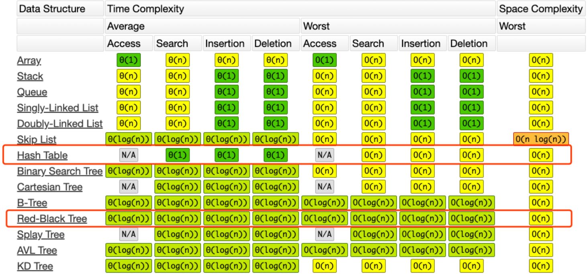

#### 实战题目

#### <a name=242>[242. 有效的字母异位词](https://leetcode-cn.com/problems/valid-anagram/)</a>

```java
/*
    判断两个单词的字母是否都一样。顺序不做要求。


    1.暴力 sort 遍历比较 
        时间复杂度 O(nlogn)
        空间复杂度 O(1)
    2.哈希表 比较字母出现的频次
        或者26个大小的数组，需要两次遍历，一边自增，一边自减。所有的都为0则相等。
        时间复杂度O(n)
        空间复杂度O(26)
*/
class Solution {
    public boolean isAnagram(String s, String t) {
        if (s.length() != t.length())
            return false;
        int[] table = new int[26];
        for (int i = 0; i < s.length(); i++) {
            table[s.charAt(i) - 'a']++;
        }
        for (int i = 0; i < t.length(); i++) {
            table[t.charAt(i) - 'a']--;
            if (table[t.charAt(i) - 'a'] < 0) { // 长度是相等的。所以判断<0就够了。
                return false;
            }
        }
        return true;
    }
}
```

#### <a name=49>[49. 字母异位词分组](https://leetcode-cn.com/problems/group-anagrams/)</a>

方法一：

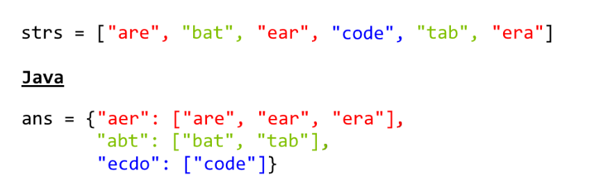

```java
/*
    方法一：
    用HashMap，key为排序后的字符串，value为原来的元素。
    返回HashMap.values。
*/
class Solution {
    public List<List<String>> groupAnagrams(String[] strs) {
        if (strs.length == 0) return new ArrayList();
        Map<String, List> ans = new HashMap<String, List>();
        for (String s : strs) {
            char[] ca = s.toCharArray(); // 每个元素变成字符串数组
            Arrays.sort(ca); // 数组排序
            String key = String.valueOf(ca); // 转成字符串作为Key
            if (!ans.containsKey(key)) ans.put(key, new ArrayList()); // 结果里没有这个key，就放入key，值为数组
            ans.get(key).add(s); // 数组里加原来这个元素
        }
        return new ArrayList(ans.values());
    }
}

```

方法二：推荐

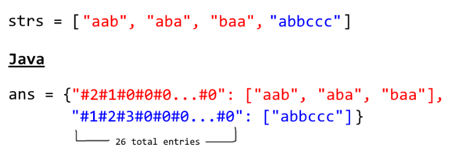


```java
/*
    方法一：
        用HashMap接收最后的结果，
        对原数组字符串进行遍历，转成字符数组，排序，转成字符串
        key为排序后的字符串，value为原来的元素。
        
        返回HashMap.values。
            时间复杂度 O(NKlogK) N是字符串数组个数 K为字符串最大长度
            空间复杂度 O(NK) 开辟的ans哈希表
    方法二：建议课后背诵
        和方法一一个意思。只是用26个数组去接。没什么意义。只是时间复杂度小。不用排序。
        时间复杂度 O(N * (K > 26 ? K : 26)) N是字符串数组个数 K为字符串最大长度
        空间复杂度 O(NK)
*/
/*
class Solution {
    public List<List<String>> groupAnagrams(String[] strs) {
        if (strs.length == 0) return new ArrayList();
        Map<String, List> ans = new HashMap<String, List>();
        for (String s : strs) {
            char[] ca = s.toCharArray(); // 每个元素变成字符串数组
            Arrays.sort(ca); // 数组排序
            String key = String.valueOf(ca); // 转成字符串作为Key
            if (!ans.containsKey(key)) ans.put(key, new ArrayList()); // 结果里没有这个key，就放入key，值为数组
            ans.get(key).add(s); // 数组里加原来这个元素
        }
        return new ArrayList(ans.values());
    }
}
*/

class Solution {
    public List<List<String>> groupAnagrams(String[] strs) {
        if (strs.length == 0) return new ArrayList();
        Map<String, List> ans = new HashMap<String, List>();
        int[] count = new int[26];
        for (String s : strs) {
            Arrays.fill(count, 0); // 数组每个值赋0
            for (char c : s.toCharArray()) count[c - 'a']++; // 字母对应位自增
            StringBuilder sb = new StringBuilder("");
            for (int i = 0; i < 26; i++) {
                sb.append('#');
                sb.append(count[i]); // #2#1#0#0
            }
            String key = sb.toString(); // 转成字符串作为密钥
            if (!ans.containsKey(key)) ans.put(key, new ArrayList()); // 相同key，放一个数组里
            ans.get(key).add(s);
        }
        return new ArrayList(ans.values());
    }
}
```

#### <a name=1>[1. 两数之和](https://leetcode-cn.com/problems/two-sum/)</a>

```java
/*
    找出数组中两个数字满足目标值的两个数字。只有唯一答案。

        方法一：暴力迭代
            i -> 0, len - 2
                j -> i+1, len - 1
                    nums[i] + nums[j] == target
        时间复杂度O(n^2)
        空间复杂度O(n)
        方法二： 利用哈希表，两次迭代
            第一次，将所有数字放入哈希表中，
            第二次，遍历哈希表，查找目标值-当前值的结果是否在哈希中
        时间复杂度O(n * 2)
        空间复杂度O(n)  

        方法三：建议熟记背诵
            利用哈希表，一次迭代。key是数组里面的值，value是值得索引位。

            其实只需要一次，直接判断目标值-当前值的结果是否在哈希中，
                不存在，再把值放进去。
        时间复杂度：O(n)
        空间复杂度：O(n)

*/
class Solution {
    public int[] twoSum(int[] nums, int target) {
        Map<Integer, Integer> map = new HashMap<>();
        for (int i = 0; i < nums.length; i++) {
            int complement = target - nums[i];
            if (map.containsKey(complement)) {
                return new int[] { map.get(complement), i };
            }
            map.put(nums[i], i);
        }
        throw new IllegalArgumentException("No two sum solution");
    }
}
```

### 2.树

#### 链表与树，树与图的特殊关系

`单链表多个next就变成了树（链表是特殊的树。把树逆时针旋转90度就理解了`

#### 图示

树

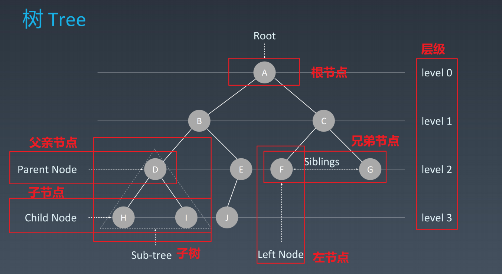


二叉树：最多两个子节点


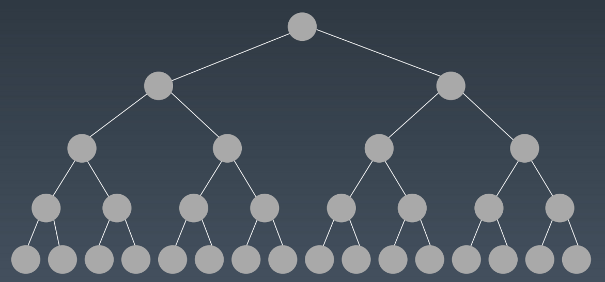

#### 代码

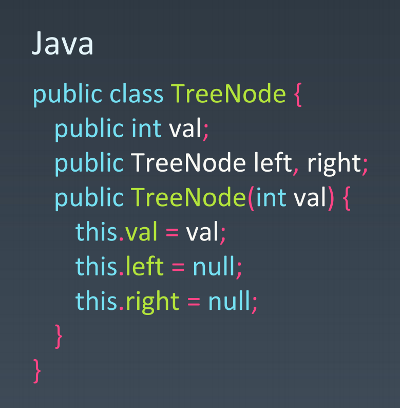

#### 二叉树遍历

1.前序（Pre-order）：**根**-左-右

2.中序（In-order）：左-**根**-右

3.后序（Post-order）：左-右-**根**

#### 二叉搜索树（排的有序的树

**定义**

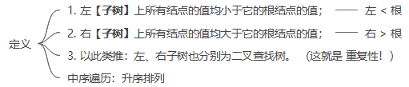

**常见操作**

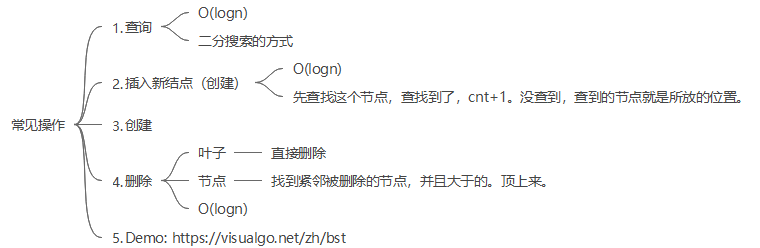

**平均时间复杂度**

O(logn)

#### 实战题目解析

#### <a name=94>[94. 二叉树的中序遍历](https://leetcode-cn.com/problems/binary-tree-inorder-traversal/)</a>


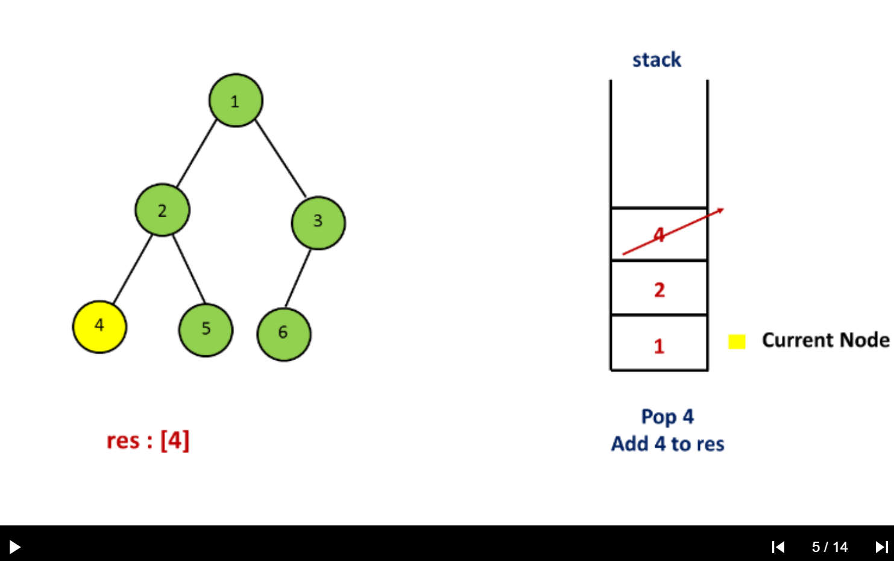

```java
/**
 * Definition for a binary tree node.
 * public class TreeNode {
 * int val;
 * TreeNode left;
 * TreeNode right;
 * TreeNode(int x) { val = x; }
 * }
 * [1,null,2,3]
 * 二叉树的中序遍历。题目说不让用递归。这题只能用栈。
        中序遍历：左-根-右

 *      方法一：递归
 *          时间复杂度 O(n)
 *          空间复杂度 O(n)
 *      方法二：栈的遍历。建议背诵。
            指针不为空，栈不为空，就不结束。
            指针不为空，就一直找左儿子，放左儿子
            直到左儿子没了，就开始弹。放入结果中。然后指右儿子。
 *          时间复杂度 O(n)
 *          空间复杂度 O(n)
        方法三：莫里斯遍历
 */
/*
class Solution {
    public List<Integer> inorderTraversal(TreeNode root) {
        List<Integer> res = new ArrayList<>();
        helper(root, res);
        return res;
    }

    public void helper(TreeNode root, List<Integer> res) {
        // 根不为空
        if (root != null) {
            // 左子树不为空
            if (root.left != null) {
                // 就放左子树
                helper(root.left, res);
            }
            // 然后放中间数
            res.add(root.val);
            // 右子树不为空，就放右子树
            if (root.right != null) {
                helper(root.right, res);
            }
        }
    }
}*/
public class Solution {
    public List<Integer> inorderTraversal(TreeNode root) {
        // 结果链表
        List<Integer> res = new ArrayList<>();
        // 栈：工具人角色
        Stack<TreeNode> stack = new Stack<>();
        // curr 当前指针，从根开始
        TreeNode curr = root;
        // 指针不为Null且栈非空
        while (curr != null || !stack.isEmpty()) {
            // 放的步骤：指针不为null。将左边的都放先进去。当没有左儿子了，就开始弹。
            while (curr != null) {
                // 把指针放进去
                stack.push(curr);
                // 指向左子树
                curr = curr.left;
            }
            // 弹出栈顶值，值放入结果链表。指针指向右儿子。
            curr = stack.pop();
            res.add(curr.val);
            curr = curr.right;
        }
        return res;
    }
}
```

#### <a name=144>[144. 二叉树的前序遍历](https://leetcode-cn.com/problems/binary-tree-preorder-traversal/)</a>

```java
/**
 * Definition for a binary tree node.
 * public class TreeNode {
 *     int val;
 *     TreeNode left;
 *     TreeNode right;
 *     TreeNode(int x) { val = x; }
 * }

    前序遍历：根，左，右

    每个数字都要遍历一遍。时间与空间复杂度都是O(n)

    方法一：
        递归 不让用
        
    方法二：
        用栈
 */
class Solution {
    public List<Integer> preorderTraversal(TreeNode root) {
        // 放树的栈：工具人
        Stack<TreeNode> stack = new Stack<>();
        LinkedList<Integer> res = new LinkedList<>();
        if (root == null) {
            return res;
        }
        stack.add(root);
        while (!stack.isEmpty()) {
            TreeNode curr = stack.pop();
            res.add(curr.val);
            if (curr.right != null) { // 先放右节点，后放左节点
                stack.add(curr.right);
            }
            if (curr.left != null) {
                stack.add(curr.left);
            }
        }
        return res;
    }
}
```

#### <a name=590>[590. N叉树的后序遍历](https://leetcode-cn.com/problems/n-ary-tree-postorder-traversal/)</a>

```java
/*
// Definition for a Node.
class Node {
    public int val;
    public List<Node> children;

    public Node() {}

    public Node(int _val) {
        val = _val;
    }

    public Node(int _val, List<Node> _children) {
        val = _val;
        children = _children;
    }
};
*/
/*
    用栈找到后序遍历的反向结果
        时间复杂度：O(M)
        空间复杂度：O(M)
    先放根节点。然后将第一排从左往右放入栈中。逆序弹出来放入结果。第二排从左往右放入栈中，逆序弹出来。
    然后反向输出后序遍历：左-右-根

*/
class Solution {
    public List<Integer> postorder(Node root) {
        List<Integer> res = new ArrayList<>();
        if(root == null) return res;
        Stack<Node> stack = new Stack<>();
        stack.push(root);
        while(!stack.isEmpty()){
            Node curr = stack.pop();
            res.add(curr.val);
            for(Node node : curr.children)
                stack.push(node);
        }
        Collections.reverse(res);
        return res;
    }
}
```

### 3.堆

#### 定义

迅速找到一堆数中的最大值或者最小值O(1)

根节点是最大值叫大顶堆，根节点是最小值叫小顶堆

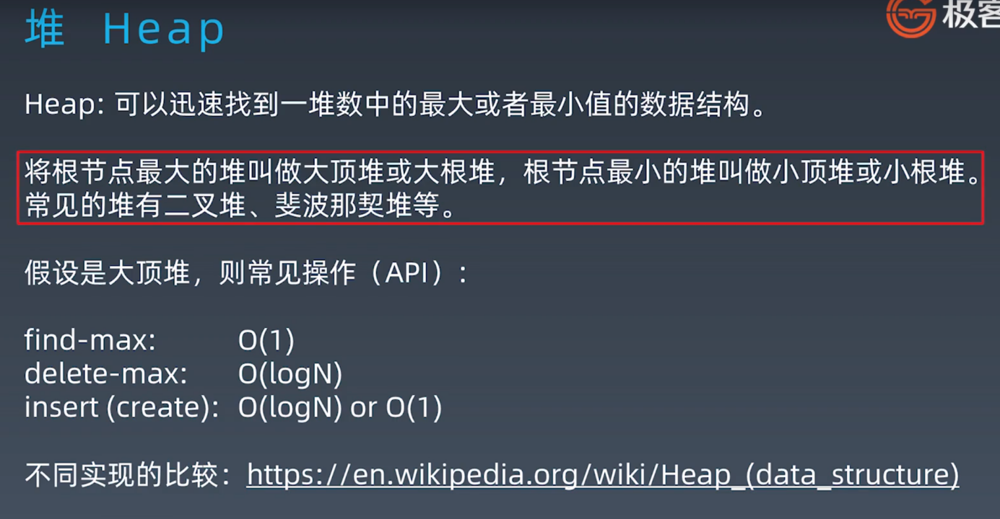

#### 基本操作

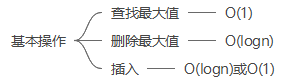

### 4.二叉堆

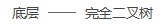

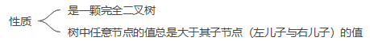

#### 图示

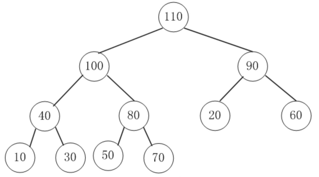

#### 插入操作

1. 新元素插入堆的尾部
2. 依次向上调整这个堆的结构（直到根即可 HeapifyUp

**时间复杂度O(log2n)**

**图示**

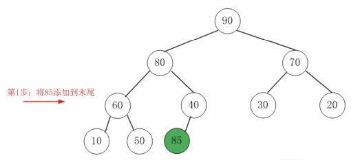


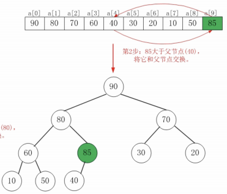

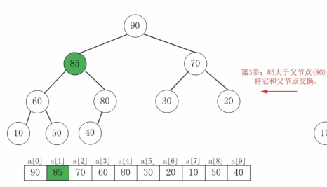

#### 删除堆顶操作

1. 将堆尾元素替换到堆顶（替换删除堆顶
2. 从根部向下调整整个堆结构 HeapifyDown，扶持左儿子与右儿子中大的上位

**时间复杂度O(logn)**

**图示**

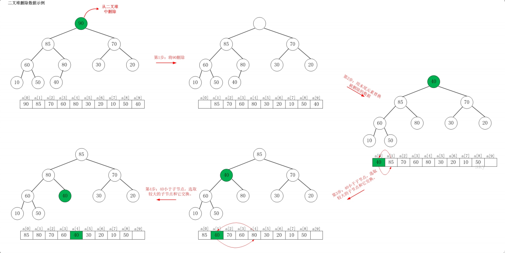

#### 实际使用工业级代码

优先队列

#### 实战题目

#### <a name=40>[剑指 Offer 40. 最小的k个数](https://leetcode-cn.com/problems/zui-xiao-de-kge-shu-lcof/)</a>

```java
/*
    寻找数组最小的前k个数


    方法一：1.先排序Sort，后截取
        时间复杂度：O(nlogn)
        空间复杂度: O(logn)
    方法二：2.最小堆
        时间复杂度: O(nlogk)
        空间复杂度: O(k)
    方法三：3.快排
        时间复杂度：最差O(n^2)
        空间复杂度：最差O(n)
*/
class Solution {
    public int[] getLeastNumbers(int[] arr, int k) {
        PriorityQueue<Integer> heap = new PriorityQueue<>();
        for (int i = 0; i < arr.length; i++) {
            heap.add(arr[i]);
        }
        int[] res = new int[k];
        for (int i = 0; i < k; i++) {
            res[i] = heap.poll();
        }
        return res;
    }
}

/*
Sort+截取
class Solution {
    public int[] getLeastNumbers(int[] arr, int k) {
        Arrays.sort(arr);
        return Arrays.copyOfRange(arr, 0, k);
    }
}
*/
```

#### <a name=239>[239. 滑动窗口最大值](https://leetcode-cn.com/problems/sliding-window-maximum/)</a>

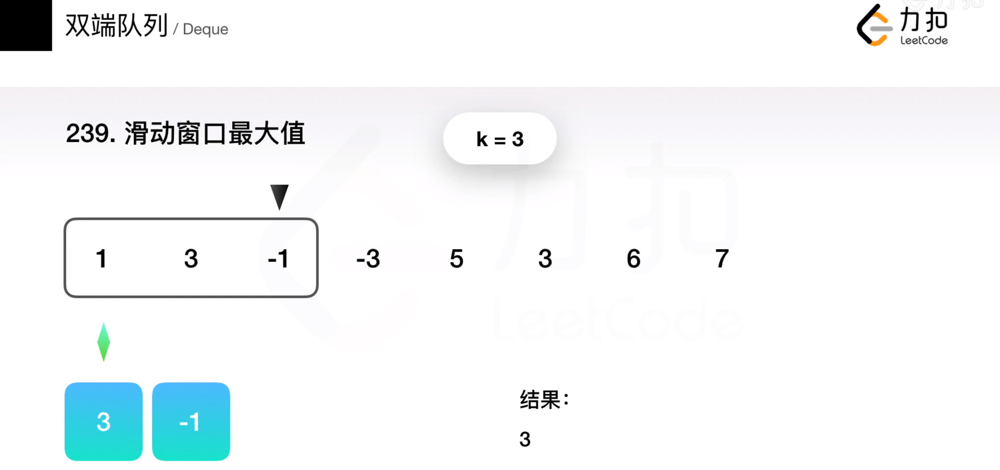

```java
/*
    有一个滑动窗口，每次向右启动，取出滑动窗口中的最大值，输出数组
        题目要求线性时间复杂度，只能用双端队列

    1.暴力。for i -> 0, n-3
                for j -> 0, 3
                    求出最大值
        时间复杂度O(n * k)
        空间复杂度O(n − k + 1)
    2.双端队列
        出入队列就可以了。
        新的元素进来，更大，其他的元素就可以出去了。
        时间复杂度O(n)
        空间复杂度O(n)
    3.维护一个最大堆
        会超时，不能使用    
*/
/*
class Solution {
    public int[] maxSlidingWindow(int[] nums, int k) {
        //  [1  3  -1] -3  5  3  6  7 last
        if (nums == null || nums.length < 2) return nums;
        // 双端队列，保存当前窗口最大值的数组，从大到小排序
        LinkedList<Integer> queue = new LinkedList();
        // 结果数组
        int[] result = new int[nums.length - k + 1];
        // 遍历nums数组
        for (int i = 0; i < nums.length; i++) {
            // 添加新元素前处理旧元素。保证从大到小，如果右边数小则需要依次弹出，直至满足要求
            while (!queue.isEmpty() && nums[queue.peekLast()] <= nums[i])
                queue.pollLast();
            // 添加当前值
            queue.addLast(i);
            // 数组满了，删除第一个元素
            if (queue.peek() <= i - k) {
                queue.poll();
            }
            // 当窗口长度为k时，保存当前窗口中最大值
            if (i + 1 >= k) {
                result[i + 1 - k] = nums[queue.peek()];
            }
        }
        return result;
    }
}
*/

public class Solution {
    public int[] maxSlidingWindow(int[] nums, int k) {
        if (nums.length == 0) return nums;
        // 结果数组
        int[] res = new int[nums.length - k + 1];
        // 双端队列，维护一个左大右小，最多k个数的双端队列(里面放的数组的索引值
        LinkedList<Integer> dq = new LinkedList<>();
        for (int i = 0; i < nums.length; i++) {
            // 迭代器到达目标位置。移动一次，删一个左边元素。最左边的元素索引值正好超出去。
            if (!dq.isEmpty() && dq.getFirst() <= i - k) {
                dq.pollFirst();
            }
            // 如果新元素比右边的大，删除右边的元素
            while (!dq.isEmpty() && nums[i] >= nums[dq.peekLast()]) {
                dq.pollLast();
            }
            // 加入新元素
            dq.add(i);
            // 到达指定位置，将左边最大值放入数组中
            if (i + 1 >= k) {
                res[i +1 - k] = nums[dq.getFirst()];
            }
        }
        return res;
    }
}


/* 用最大堆会超时
public class Solution {
    public int[] maxSlidingWindow(int[] nums, int k) {
        // assume nums is not null
        if (nums.length == 0 || k == 0) {
            return new int[0];
        }
        int n = nums.length;
        int[] result = new int[n - k + 1]; // number of windows
        // 创建最大堆
        PriorityQueue<Integer> maxPQ = new PriorityQueue<>((o1, o2) -> (o2 - o1));
        for (int i = 0; i < n; i++) {
            int start = i - k;
            if (start >= 0) {
                maxPQ.remove(nums[start]);
            }
            maxPQ.offer(nums[i]);
            // 当装满后，开始取值
            if (maxPQ.size() == k) {
                result[i - k + 1] = maxPQ.peek();
            }
        }
        return result;
    }
}
*/
```

#### <a name=347>[347. 前 K 个高频元素](https://leetcode-cn.com/problems/top-k-frequent-elements/)</a>

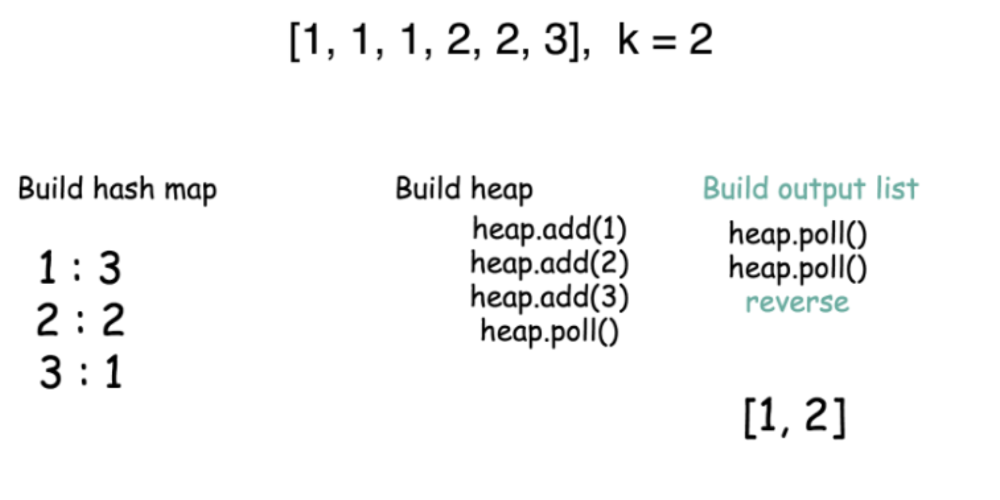

```java
/*
    输入: nums = [1,1,1,2,2,3], k = 2
    输出: [1,2]
    数字是有序的。
    返回出现频率前k高的元素。时间复杂度要优于O(nlogn)
    用大顶堆
*/
public class Solution {
    public int[] topKFrequent(int[] nums, int k) {
        // 建立一张哈希表，key为数字，value为出现次数
        HashMap<Integer, Integer> map = new HashMap();
        for (int n : nums) {
            map.put(n, map.getOrDefault(n, 0) + 1);
        }
        // 维护一个堆。出现次数少的，放在堆顶。
        PriorityQueue<Integer> heap =
                new PriorityQueue<Integer>((n1, n2) -> map.get(n1) - map.get(n2)); // map.get(n1) - map.get(n2)小于0，n1就放在前面
        // 维护一个最小堆，堆元素保持在k个内，超过就将最小值删了
        for (int n : map.keySet()) {
            heap.add(n);
            if (heap.size() > k)
                heap.poll();
        }
        // 生成结果数组
        List<Integer> list = new LinkedList<>();
        // 把堆最小值放进去，相反输出
        while (!heap.isEmpty())
            list.add(heap.poll());
        Collections.reverse(list);
        int[] res = new int[list.size()];
        for (int i = 0; i < list.size(); i++) {
            res[i] = list.get(i);
        }
        return res;
    }

    public static void main(String[] args){
        System.out.println(new Solution().topKFrequent(new int[]{1,1,1,2,2,3}, 2));
    }
}
```

#### <a name=491>[剑指 Offer 49. 丑数](https://leetcode-cn.com/problems/chou-shu-lcof/)</a>

```java
/*
    包含质因子2，3，5的都是丑数，求第n位丑数。
    维护一个最小堆，每次把最小值弹出来。
 */
public class Solution {

    private final int[] uglyNumber = {2, 3, 5};

    public int nthUglyNumber(int n) {
        //创建小顶堆，每次出堆的都是最小值
        PriorityQueue<Long> queue = new PriorityQueue<>();
        queue.add(1L);
        //记录出堆的个数，出堆的元素完全按照从小到大排序
        int cnt = 0;
        while (!queue.isEmpty()) {
            // 维护了一个最小堆，弹出来的都是最小值。
            long cur = queue.poll();
            //如果出堆的个数>=n,当前cut就是第n个丑数
            if (++cnt >= n) {
                return (int) cur;
            }
            // 任何数乘以2，3，5都是丑数
            for (int num : uglyNumber) {
                //排除重复的数字
                if (!queue.contains(num * cur)) queue.add(num * cur);
            }
        }
        return -1;
    }
}
```

### 5.图

#### 图的属性

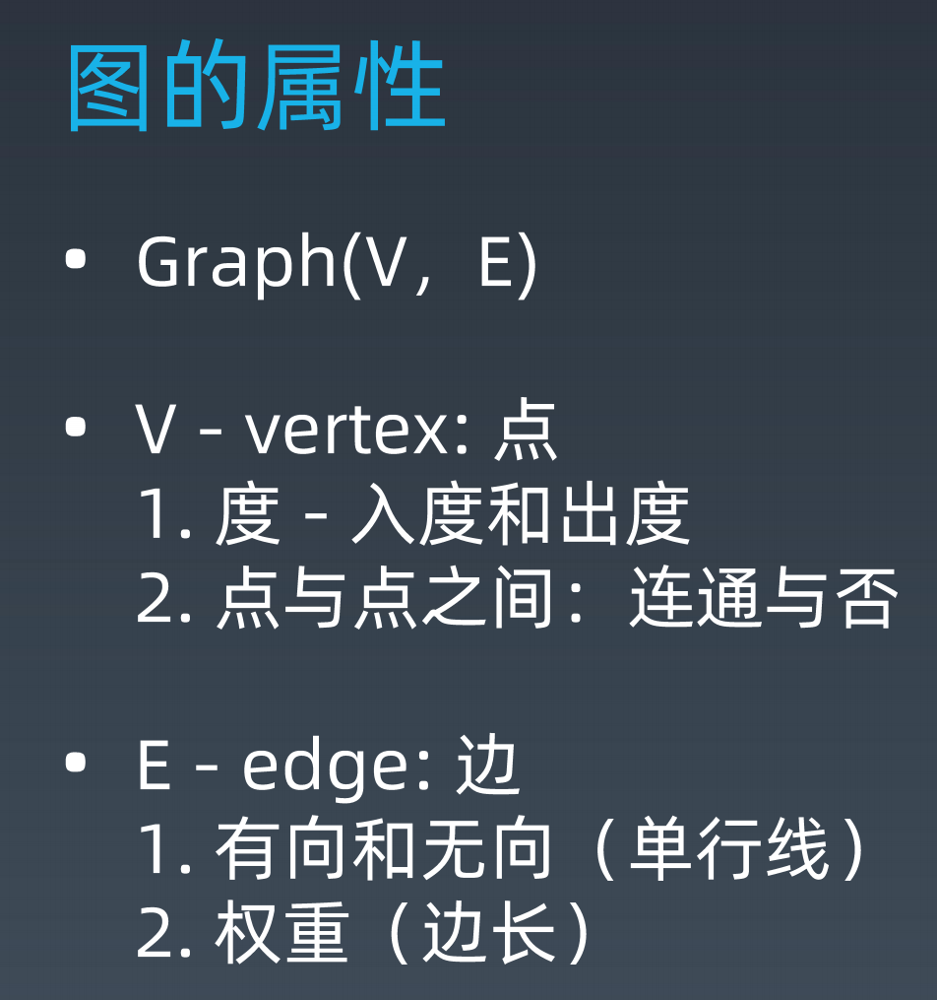

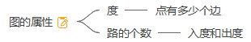

#### 图的表示

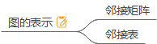

#### 图的分类

无向无权图

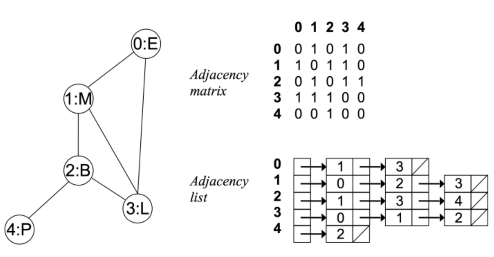

有向无权图

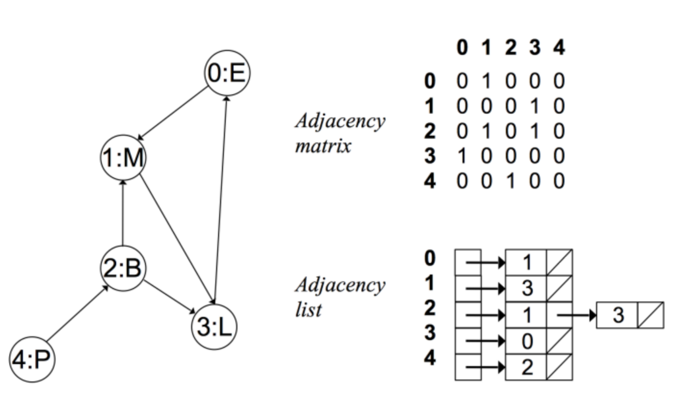

无向有权图

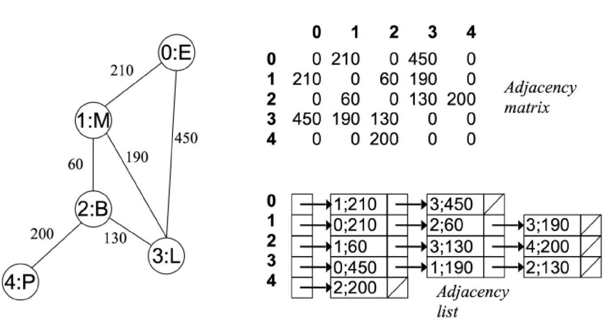

#### 图的相关算法

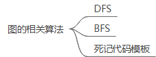

#### 实战题目

#### <a name=200>[200. 岛屿数量](https://leetcode-cn.com/problems/number-of-islands/)

- 连通图个数：[ https://leetcode-cn.com/problems/number-of-islands/](https://leetcode-cn.com/problems/number-of-islands/)
- 拓扑排序（Topological Sorting）：[ https://zhuanlan.zhihu.com/p/34871092](https://zhuanlan.zhihu.com/p/34871092)
- 最短路径（Shortest Path）：Dijkstra https://www.bilibili.com/video/av25829980?from=search&seid=13391343514095937158
- 最小生成树（Minimum Spanning Tree）：[ https://www.bilibili.com/video/av84820276?from=search&seid=17476598104352152051](https://www.bilibili.com/video/av84820276?from=search&seid=17476598104352152051)


## 作业

### 简单

- 写一个关于 HashMap 的小总结。
  说明：对于不熟悉 Java 语言的同学，此项作业可选做。
- [有效的字母异位词](https://leetcode-cn.com/problems/valid-anagram/description/)（亚马逊、Facebook、谷歌在半年内面试中考过）
- [两数之和](https://leetcode-cn.com/problems/two-sum/description/)（近半年内，亚马逊考查此题达到 216 次、字节跳动 147 次、谷歌 104 次，Facebook、苹果、微软、腾讯也在近半年内面试常考）
- [N 叉树的前序遍历](https://leetcode-cn.com/problems/n-ary-tree-preorder-traversal/description/)（亚马逊在半年内面试中考过）
- HeapSort ：自学 https://www.geeksforgeeks.org/heap-sort/

### 中等

- [字母异位词分组](https://leetcode-cn.com/problems/group-anagrams/)（亚马逊在半年内面试中常考）
- [二叉树的中序遍历](https://leetcode-cn.com/problems/binary-tree-inorder-traversal/)（亚马逊、字节跳动、微软在半年内面试中考过）
- [二叉树的前序遍历](https://leetcode-cn.com/problems/binary-tree-preorder-traversal/)（字节跳动、谷歌、腾讯在半年内面试中考过）
- [N 叉树的层序遍历](https://leetcode-cn.com/problems/n-ary-tree-level-order-traversal/)（亚马逊在半年内面试中考过）
- [丑数](https://leetcode-cn.com/problems/chou-shu-lcof/)（字节跳动在半年内面试中考过）
- [前 K 个高频元素](https://leetcode-cn.com/problems/top-k-frequent-elements/)（亚马逊在半年内面试中常考）


### 答案

| 题目                                                         | 分类     | 答案链接                        |
| ------------------------------------------------------------ | -------- | ------------------------------- |
| [242.有效的字母异位词](https://leetcode-cn.com/problems/valid-anagram/description/) | 哈希表   | <a href="#242">跳转链接</a>     |
| [49. 字母异位词分组](https://leetcode-cn.com/problems/group-anagrams/) | 26个数组 | <a href="#49">跳转链接</a>      |
| [1. 两数之和](https://leetcode-cn.com/problems/two-sum/)     | 哈希表   | <a href="#1">跳转链接</a>       |
| [94. 二叉树的中序遍历](https://leetcode-cn.com/problems/binary-tree-inorder-traversal/) | 栈       | <a href="#94">跳转链接</a>      |
| [144. 二叉树的前序遍历](https://leetcode-cn.com/problems/binary-tree-preorder-traversal/) | 栈       | <a href="#144">跳转链接</a>     |
| [590. N叉树的后序遍历](https://leetcode-cn.com/problems/n-ary-tree-postorder-traversal/) | 栈       | <a href="#590">跳转链接</a>     |
| [剑指 Offer 40. 最小的k个数](https://leetcode-cn.com/problems/zui-xiao-de-kge-shu-lcof/) | 优先队列 | <a href="#40">跳转链接</a>      |
| [239. 滑动窗口最大值](https://leetcode-cn.com/problems/sliding-window-maximum/) | 优先队列 | <a href="#239">跳转链接</a>     |
| [347. 前 K 个高频元素](https://leetcode-cn.com/problems/top-k-frequent-elements/) | 优先队列 | <a href="#347">跳转链接</a>     |
| [剑指 Offer 49. 丑数](https://leetcode-cn.com/problems/chou-shu-lcof/) | 最小堆   | <a href="#491">跳转链接</a>     |
| HashMap源码分析                                              | 哈希表   | <a href="#HashMap">跳转链接</a> |


