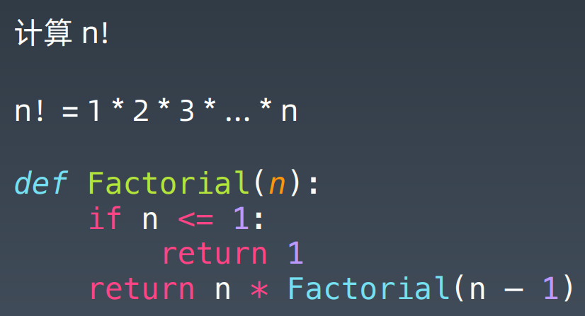
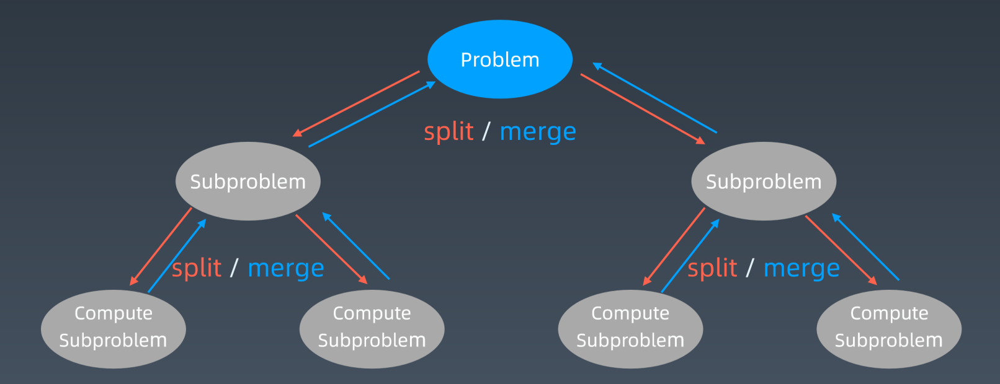
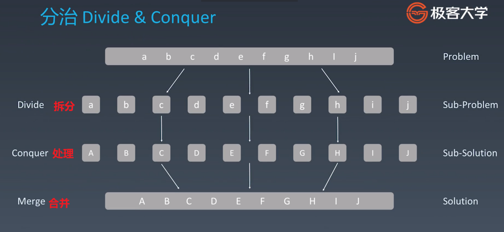

[TOC]

## 1.递归

### 树的面试题

一般都是递归

1. 节点的定义
2. 重复性

Java前序遍历

```java
public class Solution {
    List<Integer> traversal = new ArrayList<>();
    public List<Integer> preorderTraversal(TreeNode root) {
        if (root != null) {helper(root);}
        return traversal;
    }
    void helper (TreeNode root){
        traversal.add(root.val);
        if (root.left != null) {helper(root.left);}
        if (root.right != null) {helper(root.right);}
    }
}
```

Java中序遍历

```java
class Solution {
    public List<Integer> inorderTraversal(TreeNode root) {
        List<Integer> res = new ArrayList<>();
        helper(root, res);
        return res;
    }


    public void helper(TreeNode root, List<Integer> res) {
        // 根不为空
        if (root != null) {
            // 左子树不为空
            if (root.left != null) {
                // 就放左子树
                helper(root.left, res);
            }
            // 然后放中间数
            res.add(root.val);
            // 右子树不为空，就放右子树
            if (root.right != null) {
                helper(root.right, res);
            }
        }
    }
}
```

Java后序遍历

```java
public class Solution {
    List<Integer> traversal = new ArrayList<>();
    public List<Integer> preorderTraversal(TreeNode root) {
        if (root != null) {helper(root);}
        return traversal;
    }
    void helper (TreeNode root){
        traversal.add(root.val);
        if (root.left != null) {helper(root.left);}
        if (root.right != null) {helper(root.right);}
    }
}
```

### 递归

**递归本质** 

通过函数体来进行的循环

**最简单的递归形式**

阶乘



**递归模板公式**

```java
// Java
public void recur(int level, int param) {
    // 递归终止条件 
    if (level > MAX_LEVEL) {
        // 处理最后的结果
        return;
    }
    // 处理当前层逻辑
    process(level, param);
    // 下探到下一层
    recur( level: level + 1, newParam);
    // 清理当前层 
}
```

**递归思维要点**

1. 不要人肉进行递归（最大误区）

2. 【找到最近最简方法】，将其拆解成可重复解决的问题（重复子问题）

3. 数学归纳法思维

## 2.分治

**概念**

最优重复性 动态规划

最近重复性 分治/回溯

**示意图**



**代码示例**

比递归多整合子结果

## 3.回溯

**定义**

尝试下一步，不行就撤回

最差时间复杂度**指数级**

## 作业

## 本周作业

### 中等：

- [二叉树的最近公共祖先](https://leetcode-cn.com/problems/lowest-common-ancestor-of-a-binary-tree/)（Facebook 在半年内面试常考）
- [从前序与中序遍历序列构造二叉树](https://leetcode-cn.com/problems/construct-binary-tree-from-preorder-and-inorder-traversal/)（字节跳动、亚马逊、微软在半年内面试中考过）
- [组合](https://leetcode-cn.com/problems/combinations/)（微软、亚马逊、谷歌在半年内面试中考过）
- [全排列](https://leetcode-cn.com/problems/permutations/)（字节跳动在半年内面试常考）
- [全排列 II ](https://leetcode-cn.com/problems/permutations-ii/)（亚马逊、字节跳动、Facebook 在半年内面试中考过）


[二叉树的最近公共祖先](https://leetcode-cn.com/problems/lowest-common-ancestor-of-a-binary-tree/)（Facebook 在半年内面试常考）

```java
class Solution {
    public TreeNode lowestCommonAncestor(TreeNode root, TreeNode p, TreeNode q) {
        /**
        注意p,q必然存在树内, 且所有节点的值唯一!!!
        递归思想, 对以root为根的(子)树进行查找p和q, 如果root == null || p || q 直接返回root
        表示对于当前树的查找已经完毕, 否则对左右子树进行查找, 根据左右子树的返回值判断:
        1. 左右子树的返回值都不为null, 由于值唯一左右子树的返回值就是p和q, 此时root为LCA
        2. 如果左右子树返回值只有一个不为null, 说明只有p和q存在与左或右子树中, 最先找到的那个节点为LCA
        3. 左右子树返回值均为null, p和q均不在树中, 返回null
        **/
        if(root == null || root == p || root == q) return root;
        TreeNode left = lowestCommonAncestor(root.left, p, q);
        TreeNode right = lowestCommonAncestor(root.right, p, q);
        if(left == null && right == null) return null;
        else if(left != null && right != null) return root;
        else return left == null ? right : left;
    }
}
```


[从前序与中序遍历序列构造二叉树](https://leetcode-cn.com/problems/construct-binary-tree-from-preorder-and-inorder-traversal/)（字节跳动、亚马逊、微软在半年内面试中考过）

```java
class Solution {
    public TreeNode buildTree(int[] preorder, int[] inorder) {
        if (preorder == null || preorder.length == 0) {
            return null;
        }
        TreeNode root = new TreeNode(preorder[0]);
        Stack<TreeNode> stack = new Stack<TreeNode>();
        stack.push(root);
        int inorderIndex = 0;
        for (int i = 1; i < preorder.length; i++) {
            int preorderVal = preorder[i];
            TreeNode node = stack.peek();
            if (node.val != inorder[inorderIndex]) {
                node.left = new TreeNode(preorderVal);
                stack.push(node.left);
            } else {
                while (!stack.isEmpty() && stack.peek().val == inorder[inorderIndex]) {
                    node = stack.pop();
                    inorderIndex++;
                }
                node.right = new TreeNode(preorderVal);
                stack.push(node.right);
            }
        }
        return root;
    }
}
```


[组合](https://leetcode-cn.com/problems/combinations/)（微软、亚马逊、谷歌在半年内面试中考过）

```java
class Solution {
    
    public List<List<Integer>> combine(int n, int k) {
        if (k == n || k == 0) {
            List<Integer> row = new LinkedList<>();
            for (int i = 1; i <= k; ++i) {
                row.add(i);
            }
            return new LinkedList<>(Arrays.asList(row));
        }
        // n - 1 里边选 k - 1 个
        List<List<Integer>> result = combine(n - 1, k - 1);
        //每个结果加上 n
        result.forEach(e -> e.add(n));
        //把 n - 1 个选 k 个的结果也加入
        result.addAll(combine(n - 1, k));
        return result;
    }
}
```


[全排列](https://leetcode-cn.com/problems/permutations/)（字节跳动在半年内面试常考）

```java
class Solution {
    public List<List<Integer>> permute(int[] nums) {

        List<List<Integer>> res = new ArrayList<>();
        int[] visited = new int[nums.length];
        backtrack(res, nums, new ArrayList<Integer>(), visited);
        return res;

    }

    private void backtrack(List<List<Integer>> res, int[] nums, ArrayList<Integer> tmp, int[] visited) {
        if (tmp.size() == nums.length) {
            res.add(new ArrayList<>(tmp));
            return;
        }
        for (int i = 0; i < nums.length; i++) {
            if (visited[i] == 1) continue;
            visited[i] = 1;
            tmp.add(nums[i]);
            backtrack(res, nums, tmp, visited);
            visited[i] = 0;
            tmp.remove(tmp.size() - 1);
        }
    }
}
```


[全排列 II ](https://leetcode-cn.com/problems/permutations-ii/)（亚马逊、字节跳动、Facebook 在半年内面试中考过）

```java
public class Solution {

    public List<List<Integer>> permuteUnique(int[] nums) {
        int len = nums.length;
        List<List<Integer>> res = new ArrayList<>();
        if (len == 0) {
            return res;
        }

        // 排序（升序或者降序都可以），排序是剪枝的前提
        Arrays.sort(nums);

        boolean[] used = new boolean[len];
        // 使用 Deque 是 Java 官方 Stack 类的建议
        Deque<Integer> path = new ArrayDeque<>(len);
        dfs(nums, len, 0, used, path, res);
        return res;
    }

    private void dfs(int[] nums, int len, int depth, boolean[] used, Deque<Integer> path, List<List<Integer>> res) {
        if (depth == len) {
            res.add(new ArrayList<>(path));
            return;
        }

        for (int i = 0; i < len; ++i) {
            if (used[i]) {
                continue;
            }

            // 剪枝条件：i > 0 是为了保证 nums[i - 1] 有意义
            // 写 !used[i - 1] 是因为 nums[i - 1] 在深度优先遍历的过程中刚刚被撤销选择
            if (i > 0 && nums[i] == nums[i - 1] && !used[i - 1]) {
                continue;
            }

            path.addLast(nums[i]);
            used[i] = true;

            dfs(nums, len, depth + 1, used, path, res);
            // 回溯部分的代码，和 dfs 之前的代码是对称的
            used[i] = false;
            path.removeLast();
        }
    }

    public static void main(String[] args) {
        Solution solution = new Solution();
        int[] nums = {1, 1, 2};
        List<List<Integer>> res = solution.permuteUnique(nums);
        System.out.println(res);
    }
}
```

