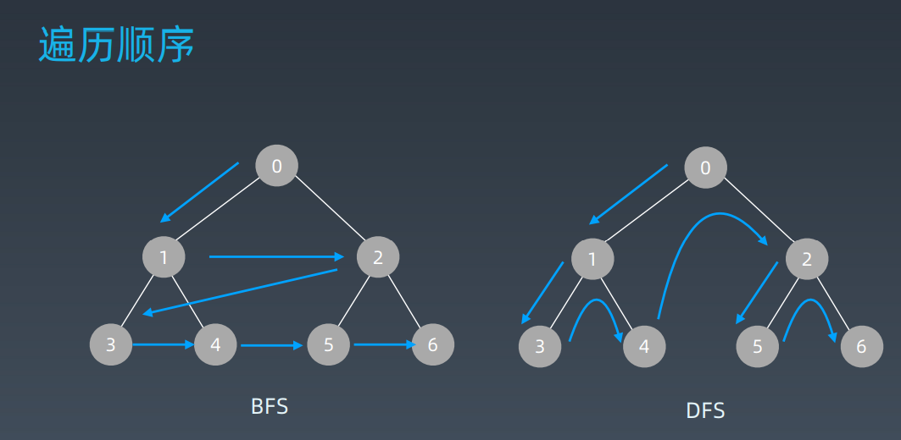
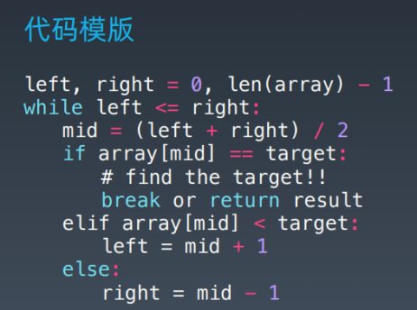

学习笔记

[TOC]

## 深度/广度优先搜索

### 树的遍历搜索

- 每个节点都要访问一次
- 每个节点只访问一次
- 对于节点的访问顺序不限
  - 深度优先：depth first search
  - 广度优先：breadth first search

### 深度优先搜索DFS

遍历顺序

> 沿着一条路径不断往下搜索知道不能再继续，然后折返，搜索下一条候补路径

代码模板

**递归实现** 背诵默写

```java
// 递归实现
public class Solution {

    public static TreeNode createBinaryTree(LinkedList<Integer> inputList) {
        TreeNode node = null;
        if (inputList == null || inputList.isEmpty()) return null;
        Integer data = inputList.removeFirst();
        // 为空，则不继续递归
        if (data != null) {
            node = new TreeNode(data);
            node.leftChild = createBinaryTree(inputList);
            node.rightChild = createBinaryTree(inputList);
        }
        return node;
    }

    /**
     * 二叉树的前序遍历
     */
    public static void preOrderTraversal(TreeNode node) {
        if (node == null) return;
        System.out.println(node.data);
        preOrderTraversal(node.leftChild);
        preOrderTraversal(node.rightChild);
    }

    /**
     * 二叉树的中序遍历
     */
    public static void inOrderTraversal(TreeNode node) {
        if (node == null) return;
        inOrderTraversal(node.leftChild);
        System.out.println(node.data);
        inOrderTraversal(node.rightChild);
    }

    /**
     * 二叉树的后序遍历
     */
    public static void postOrderTraversal(TreeNode node) {
        if (node == null) return;
        postOrderTraversal(node.leftChild);
        postOrderTraversal(node.rightChild);
        System.out.println(node.data);
    }

    public static void main(String[] args) {
        LinkedList<Integer> inputList = new LinkedList<>(Arrays.asList(3, 2, 9, null, null, 10, null, null, 8, null, 4));
        TreeNode treeNode = createBinaryTree(inputList);
        System.out.println("前序遍历：");
        preOrderTraversal(treeNode);
        System.out.println("中序遍历：");
        inOrderTraversal(treeNode);
        System.out.println("后序遍历：");
        postOrderTraversal(treeNode);
    }

    /**
     * 二叉树节点
     */
    private static class TreeNode {
        int data;
        TreeNode leftChild;
        TreeNode rightChild;

        TreeNode(int data) {
            this.data = data;
        }
    }
}
```

**栈实现** 背诵默写

```java
// 栈
public class Solution {

    /**
     * 二叉树节点
     */
    private static class TreeNode {
        int data;
        TreeNode leftChild;
        TreeNode rightChild;

        TreeNode(int data) {
            this.data = data;
        }
    }

    public static void preOrderTraversalWithStack(TreeNode root) {
        Stack<TreeNode> stack = new Stack<>();
        TreeNode treeNode = root;
        while(treeNode != null || !stack.isEmpty()) {
            // 迭代访问左孩子，并入栈
            while(treeNode != null) {
                System.out.println(treeNode.data);
                stack.push(treeNode);
                treeNode = treeNode.leftChild;
            }
            // 如果节点没有左孩子，则弹出栈顶结点，访问节点右孩子
            if(!stack.isEmpty()) {
                treeNode = stack.pop();
                treeNode = treeNode.rightChild;
            }
        }
    }
}
```


### 广度优先搜索BFS

遍历顺序

> 从起点最近的顶点开始搜索

代码模板

```java
// 层序遍历
public class Solution {

    /**
     * 二叉树节点
     */
    private static class TreeNode {
        int data;
        TreeNode leftChild;
        TreeNode rightChild;

        TreeNode(int data) {
            this.data = data;
        }
    }

    public static void bfs(TreeNode root) {
        LinkedList<TreeNode> queue = new LinkedList<>();
        queue.add(root);
        while(!queue.isEmpty()){
            TreeNode node = queue.poll();
            System.out.println(node.data);
            if(node.leftChild !=null) queue.add(node.leftChild);
            if(node.rightChild != null) queue.add(node.rightChild);
        }
    }
}
```

图示



### 实战题目

#### [102. 二叉树的层序遍历](https://leetcode-cn.com/problems/binary-tree-level-order-traversal/)

```java

/*
    把二叉树的每层放在一个数组中打印出来
    1.BFS
    2.DFS 记录层数

*/
class Solution {
    public List<List<Integer>> levelOrder(TreeNode root) {
        List<List<Integer>> res = new ArrayList<>();

        Queue<TreeNode> queue = new ArrayDeque<>();
        if (root != null) {
            queue.add(root);
        }
        while (!queue.isEmpty()) {
            int n = queue.size();
            List<Integer> level = new ArrayList<>();
            for (int i = 0; i < n; i++) { 
                TreeNode node = queue.poll();
                level.add(node.val);
                if (node.left != null) {
                    queue.add(node.left);
                }
                if (node.right != null) {
                    queue.add(node.right);
                }
            }
            res.add(level);
        }

        return res;
    }
}
```

#### [433. 最小基因变化](https://leetcode-cn.com/problems/minimum-genetic-mutation/)

```java
class Solution {
    int res = Integer.MAX_VALUE;
    public int minMutation(String start, String end, String[] bank) {
        dfs(new HashSet<String>(), 0, start, end, bank);
        return (res == Integer.MAX_VALUE) ? -1 : res;
    }
    private void dfs (HashSet<String> step, int n, String temp, String end, String[] bank){
        if(n>=res) return;
        if(temp.equals(end)){
            res = Math.min(n,res);
            return;
        }
        char[] c = temp.toCharArray();
        for(String s:bank){
            char[] ss = s.toCharArray();
            int num = 0;
            for(int i = 0;i<8;i++){
                if(c[i]!=ss[i]) num++;
            }
            if(num == 1 &&!step.contains(s)){
                //这个可以是下一个分支
                step.add(s);
                dfs(step,n+1,s,end,bank);
                step.remove(s);
            }
        }
    }
}
```

#### [22. 括号生成](https://leetcode-cn.com/problems/generate-parentheses/)

```java
/*
    生成所有n个有效括号
        输入：n = 3
        输出：[
               "((()))",
               "(()())",
               "(())()",
               "()(())",
               "()()()"
             ]
 */

 // 递归
// public class Solution {

//     ArrayList<String> res = new ArrayList<>();

//     public List<String> generateParenthesis(int n) {
//         // 初始条件
//         generate(0, 0, n, "");
//         // 结束条件
//         return res;
//     }

//     // 处理
//     private void generate(int leftCnt, int rightCnt, int n, String s) {
//         // 下钻
//         // 如果左、右括号等于n个，将值放入结果中
//         if (leftCnt == n && rightCnt == n) {
//             res.add(s);
//             return;
//         }
//         // 只要左括号没有达到n个，就可以加
//         if (leftCnt < n) generate(leftCnt + 1, rightCnt, n, s + "(");
//         // 右括号数量如果小于左括号，就可以加
//         if (rightCnt < leftCnt) generate(leftCnt, rightCnt + 1, n, s + ")");
//         // 清除全局临时变量
//     }

//     public static void main(String[] args) {
//         System.out.println(new Solution().generateParenthesis(3));
//     }
// }

// 递归。确保括号有效性。只要要求左括号先行于右括号。
class Solution {
    List<String> res = new ArrayList<>();
    public List<String> generateParenthesis(int n) {
        dfs(n, n, "");
        return res;
    }

    private void dfs(int left, int right, String curStr) {
        if (left == 0 && right == 0) { // 左右括号都不剩余了，递归终止
            res.add(curStr);
            return;
        }
        // 第一次会进去。第二次会有两个分叉
        if (left > 0) { // 如果左括号还剩余的话，可以拼接左括号
            dfs(left - 1, right, curStr + "(");
        }
        // 第一次是进不去的，因为左右是相等的。第二次进入后，左右等号数量又相等了。
        if (right > left) { // 如果右括号剩余多于左括号剩余的话，可以拼接右括号
            dfs(left, right - 1, curStr + ")");
        }
    }
}
```

#### [515. 在每个树行中找最大值](https://leetcode-cn.com/problems/find-largest-value-in-each-tree-row/)

```java
class Solution {
    public List<Integer> largestValues(TreeNode root) {
        List<Integer> res = new ArrayList<>();
        levelOrder(root, res, 0);
        return res;
    }
    
    public void levelOrder(TreeNode root, List<Integer> res, int level) {//当前root是第level层
        if(root==null) return;
        if(level>=res.size()) {res.add(root.val);}
        else {
            int max_value = Math.max(res.get(level), root.val);
            res.set(level, max_value);
        }
        levelOrder(root.left,res,level+1);
        levelOrder(root.right,res,level+1);


    }
}
```

## 贪心算法

**定义**

贪心算法是一种在每一步选择中都采取在当前状态下最好或最优（即最有利）的选择，从而希望导致结果是全局最好或最优的算法。

**贪心vs回溯vs动态**

- 贪心
  - 当下做局部最优判断
- 回溯
  - 能够回退
- 动态规划
  - 最优判断+回退

**适用贪心算法的场景**

能分为子问题。子问题的最优解能递推到最终问题的最优解。

**场景**

求图中的最小生成树

求哈夫曼编码

## 二分查找

**前提条件**

- 单调性
- 有界
- 有索引访问

**代码模板**



## 本周作业

### 简单：

- [柠檬水找零](https://leetcode-cn.com/problems/lemonade-change/description/)（亚马逊在半年内面试中考过）
- [买卖股票的最佳时机 II ](https://leetcode-cn.com/problems/best-time-to-buy-and-sell-stock-ii/description/)（亚马逊、字节跳动、微软在半年内面试中考过）
- [分发饼干](https://leetcode-cn.com/problems/assign-cookies/description/)（亚马逊在半年内面试中考过）
- [模拟行走机器人](https://leetcode-cn.com/problems/walking-robot-simulation/description/)
- 使用二分查找，寻找一个半有序数组 [4, 5, 6, 7, 0, 1, 2] 中间无序的地方
  说明：同学们可以将自己的思路、代码写在第 4 周的学习总结中

### 中等：

- [单词接龙](https://leetcode-cn.com/problems/word-ladder/description/)（亚马逊在半年内面试常考）
- [岛屿数量](https://leetcode-cn.com/problems/number-of-islands/)（近半年内，亚马逊在面试中考查此题达到 350 次）
- [扫雷游戏](https://leetcode-cn.com/problems/minesweeper/description/)（亚马逊、Facebook 在半年内面试中考过）
- [跳跃游戏](https://leetcode-cn.com/problems/jump-game/) （亚马逊、华为、Facebook 在半年内面试中考过）
- [搜索旋转排序数组](https://leetcode-cn.com/problems/search-in-rotated-sorted-array/)（Facebook、字节跳动、亚马逊在半年内面试常考）
- [搜索二维矩阵](https://leetcode-cn.com/problems/search-a-2d-matrix/)（亚马逊、微软、Facebook 在半年内面试中考过）
- [寻找旋转排序数组中的最小值](https://leetcode-cn.com/problems/find-minimum-in-rotated-sorted-array/)（亚马逊、微软、字节跳动在半年内面试中考过）

### 困难

- [单词接龙 II ](https://leetcode-cn.com/problems/word-ladder-ii/description/)（微软、亚马逊、Facebook 在半年内面试中考过）
- [跳跃游戏 II ](https://leetcode-cn.com/problems/jump-game-ii/)（亚马逊、华为、字节跳动在半年内面试中考过）

#### [860. 柠檬水找零](https://leetcode-cn.com/problems/lemonade-change/)

```java
class Solution {
    public boolean lemonadeChange(int[] bills) {
        int five = 0, ten = 0;
        for (int i : bills) {
            if (i == 5) five++;
            else if (i == 10) {five--; ten++;}
            else if (ten > 0) {ten--; five--;} 
            else five -= 3;
            if (five < 0) return false;
        }
        return true;
    }
}
```

#### [122. 买卖股票的最佳时机 II](https://leetcode-cn.com/problems/best-time-to-buy-and-sell-stock-ii/)

```java
public class Solution {
    public int maxProfit(int[] prices) {
        int total = 0;
        for (int i=0; i< prices.length-1; i++) {
            if (prices[i+1]>prices[i]) total += prices[i+1]-prices[i];
        }
        return total;
    }
}
```

#### [455. 分发饼干](https://leetcode-cn.com/problems/assign-cookies/)

```java
class Solution {
    //贪心的思想是，用尽量小的饼干去满足小需求的孩子，所以需要进行排序先
    public int findContentChildren(int[] g, int[] s) {
        int child = 0;
        int cookie = 0;
        Arrays.sort(g);  //先将饼干 和 孩子所需大小都进行排序
        Arrays.sort(s);
        while (child < g.length && cookie < s.length ){ //当其中一个遍历就结束
            if (g[child] <= s[cookie]){ //当用当前饼干可以满足当前孩子的需求，可以满足的孩子数量+1
                child++;
            }
            cookie++; // 饼干只可以用一次，因为饼干如果小的话，就是无法满足被抛弃，满足的话就是被用了
        }
        return child; 
    }
}
```

#### [874. 模拟行走机器人](https://leetcode-cn.com/problems/walking-robot-simulation/)

```java
class Solution {
    public int robotSim(int[] commands, int[][] obstacles) {
        int[] dx = new int[]{0, 1, 0, -1};
        int[] dy = new int[]{1, 0, -1, 0};
        int x = 0, y = 0, di = 0;

        // Encode obstacles (x, y) as (x+30000) * (2^16) + (y+30000)
        Set<Long> obstacleSet = new HashSet();
        for (int[] obstacle: obstacles) {
            long ox = (long) obstacle[0] + 30000;
            long oy = (long) obstacle[1] + 30000;
            obstacleSet.add((ox << 16) + oy);
        }

        int ans = 0;
        for (int cmd: commands) {
            if (cmd == -2)  //left
                di = (di + 3) % 4;
            else if (cmd == -1)  //right
                di = (di + 1) % 4;
            else {
                for (int k = 0; k < cmd; ++k) {
                    int nx = x + dx[di];
                    int ny = y + dy[di];
                    long code = (((long) nx + 30000) << 16) + ((long) ny + 30000);
                    if (!obstacleSet.contains(code)) {
                        x = nx;
                        y = ny;
                        ans = Math.max(ans, x*x + y*y);
                    }
                }
            }
        }

        return ans;
    }
}
```

#### [127. 单词接龙](https://leetcode-cn.com/problems/word-ladder/)

```java
class Solution {
    //BFS的思想
   public int ladderLength(String beginWord, String endWord, List<String> wordList) {
		Queue<String> queue = new LinkedList<String>();//少不了队列
		queue.add(beginWord);
		boolean[] marked = new boolean[wordList.size()+1];//少不了标记
		int layer = 1;//注意返回的是层数+1.所以这里直接放1了
		while(!queue.isEmpty()) {//固定的层数记录形式
			layer++;
			int size = queue.size();
			while (size-->0) {
				String cur = queue.poll();
				for (int i = 0; i < wordList.size(); i++) {
					if(marked[i])continue;
					String dic = wordList.get(i);
					if(canChange(dic, cur)) {
						if(dic.equals(endWord))return layer;
						queue.add(dic);
						marked[i] = true;
					}
				}
			}
		}
		
		return 0;
	}
    //是否可以转换的辅助函数
	public boolean canChange(String s,String t) {
		int len = s.length();
		int diff = 0;
		for (int i = 0; i < s.length(); i++) {
			if(s.charAt(i) != t.charAt(i))diff++;
		}
		return diff==1;
	}
}
```

#### [200. 岛屿数量](https://leetcode-cn.com/problems/number-of-islands/)

```java
class Solution {
    public int numIslands(char[][] grid) {
        int islandNum = 0;
        for(int i = 0; i < grid.length; i++){
            for(int j = 0; j < grid[0].length; j++){
                if(grid[i][j] == '1'){
                    infect(grid, i, j);
                    islandNum++;
                }
            }
        }
        return islandNum;
    }
    //感染函数
    public void infect(char[][] grid, int i, int j){
        if(i < 0 || i >= grid.length ||
           j < 0 || j >= grid[0].length || grid[i][j] != '1'){
            return;
        }
        grid[i][j] = '2';
        infect(grid, i + 1, j);
        infect(grid, i - 1, j);
        infect(grid, i, j + 1);
        infect(grid, i, j - 1);
    }
}
```

#### [529. 扫雷游戏](https://leetcode-cn.com/problems/minesweeper/)

```java
class Solution {
    public char[][] updateBoard(char[][] board, int[] click) {
        if(board[click[0]][click[1]]=='M'){
            board[click[0]][click[1]]='X';
            return board;
        }
        int[][] di={{0,1},{0,-1},{1,0},{-1,0},{1,1},{-1,-1},{1,-1},{-1,1}};
        dfs(board,click[0],click[1],di);
        return board;
    }
    public void dfs(char[][] board,int x,int y,int[][] di){
        int sum=0;
        List<Integer> list=new ArrayList<>();
        for(int k=0;k<di.length;k++){
            if(x+di[k][0]<0||x+di[k][0]==board.length||y+di[k][1]<0||y+di[k][1]==board[0].length)continue;
            if(board[x+di[k][0]][y+di[k][1]]=='M')sum++;
            if(board[x+di[k][0]][y+di[k][1]]=='E')list.add(k);
        }
        board[x][y]=sum==0?'B':(char) (sum+'0');
        if(sum>0)return;
        for(int i=0;i<list.size();i++){
            dfs(board,x+di[list.get(i)][0],y+di[list.get(i)][1],di);
        }
    }
}
```

#### [55. 跳跃游戏](https://leetcode-cn.com/problems/jump-game/)

```java
class Solution {
    public boolean canJump(int[] nums) {
        int n=1;
        for(int i=nums.length-2;i>=0;i--){
            if(nums[i]>=n)
            {
                n=1;
            }
            else
            {
                n++;
            }
            if(i==0&&n>1)
            {
                return false;
            }
        }
        return true;
        
    }
}
```

#### [33. 搜索旋转排序数组](https://leetcode-cn.com/problems/search-in-rotated-sorted-array/)

```java
class Solution {
    public int search(int[] nums, int target) {
        int len = nums.length;
        int left = 0, right = len-1;
        while(left <= right){
            int mid = (left + right) / 2;
            if(nums[mid] == target)
                return mid;
            else if(nums[mid] < nums[right]){
                if(nums[mid] < target && target <= nums[right])
                    left = mid+1;
                else
                    right = mid-1;
            }
            else{
                if(nums[left] <= target && target < nums[mid])
                    right = mid-1;
                else
                    left = mid+1;
            }
        }
        return -1;
    }
}
```

#### [74. 搜索二维矩阵](https://leetcode-cn.com/problems/search-a-2d-matrix/)

```java
class Solution {
  public boolean searchMatrix(int[][] matrix, int target) {
    int m = matrix.length;
    if (m == 0) return false;
    int n = matrix[0].length;

    // 二分查找
    int left = 0, right = m * n - 1;
    int pivotIdx, pivotElement;
    while (left <= right) {
      pivotIdx = (left + right) / 2;
      pivotElement = matrix[pivotIdx / n][pivotIdx % n];
      if (target == pivotElement) return true;
      else {
        if (target < pivotElement) right = pivotIdx - 1;
        else left = pivotIdx + 1;
      }
    }
    return false;
  }
}
```

#### [153. 寻找旋转排序数组中的最小值](https://leetcode-cn.com/problems/find-minimum-in-rotated-sorted-array/)

```java
class Solution {
    public int findMin(int[] nums) {
        int left = 0;
        int right = nums.length - 1;
        while (left < right) {
            int mid = left + (right - left) / 2;
            if (nums[mid] > nums[right]) {          
                left = mid + 1;
            } else {                                
                right = mid;
            }
        }
        return nums[left];
    }
};
```

#### [126. 单词接龙 II](https://leetcode-cn.com/problems/word-ladder-ii/)

```java
class Solution {
    public List<List<String>> findLadders(String beginWord, String endWord, List<String> wordList) {
        // 结果集
        List<List<String>> res = new ArrayList<>();
        Set<String> words = new HashSet<>(wordList);
        // 字典中不包含目标单词
        if (!words.contains(endWord)) {
            return res;
        }
        // 存放关系：每个单词可达的下层单词
        Map<String, List<String>> mapTree = new HashMap<>();
        Set<String> begin = new HashSet<>(), end = new HashSet<>();
        begin.add(beginWord);
        end.add(endWord);
        if (buildTree(words, begin, end, mapTree, true)) {
            dfs(res, mapTree, beginWord, endWord, new LinkedList<>());
        }
        return res;
    }
    
    // 双向BFS，构建每个单词的层级对应关系
    private boolean buildTree(Set<String> words, Set<String> begin, Set<String> end, Map<String, List<String>> mapTree, boolean isFront){
        if (begin.size() == 0) {
            return false;
        }
        // 始终以少的进行探索
        if (begin.size() > end.size()) {
            return buildTree(words, end, begin, mapTree, !isFront);
        }
        // 在已访问的单词集合中去除
        words.removeAll(begin);
        // 标记本层是否已到达目标单词
        boolean isMeet = false;
        // 记录本层所访问的单词
        Set<String> nextLevel = new HashSet<>();
        for (String word : begin) {
            char[] chars = word.toCharArray();
            for (int i = 0; i < chars.length; i++) {
                char temp = chars[i];
                for (char ch = 'a'; ch <= 'z'; ch++) {
                    chars[i] = ch;
                    String str = String.valueOf(chars);
                    if (words.contains(str)) {
                        nextLevel.add(str);
                        // 根据访问顺序，添加层级对应关系：始终保持从上层到下层的存储存储关系
                        // true: 从上往下探索：word -> str
                        // false: 从下往上探索：str -> word（查找到的 str 是 word 上层的单词）
                        String key = isFront ? word : str;
                        String nextWord = isFront ? str : word;
                        // 判断是否遇见目标单词
                        if (end.contains(str)) {
                            isMeet = true;
                        }
                        if (!mapTree.containsKey(key)) {
                            mapTree.put(key, new ArrayList<>());
                        }
                        mapTree.get(key).add(nextWord);
                    }
                }
                chars[i] = temp;
            }
        }
        if (isMeet) {
            return true;
        }
        return buildTree(words, nextLevel, end, mapTree, isFront);
    }
    
    // DFS: 组合路径
    private void dfs (List<List<String>> res, Map<String, List<String>> mapTree, String beginWord, String endWord, LinkedList<String> list) {
        list.add(beginWord);
        if (beginWord.equals(endWord)) {
            res.add(new ArrayList<>(list));
            list.removeLast();
            return;
        }
        if (mapTree.containsKey(beginWord)) {
            for (String word : mapTree.get(beginWord)) {
                dfs(res, mapTree, word, endWord, list);
            }
        }
        list.removeLast();
    }

}
```

#### [45. 跳跃游戏 II](https://leetcode-cn.com/problems/jump-game-ii/)

```java
class Solution {
    public int jump(int[] nums) {
        if(nums.length == 1) return 0;
        int reach = 0;
        int nextreach = nums[0];
        int step = 0;
        for(int i = 0;i<nums.length;i++){
            nextreach = Math.max(i+nums[i],nextreach);
            if(nextreach >= nums.length-1) return (step+1);
            if(i == reach){
                step++;
                reach = nextreach;
            }
        }
        return step;
    }
}
```

